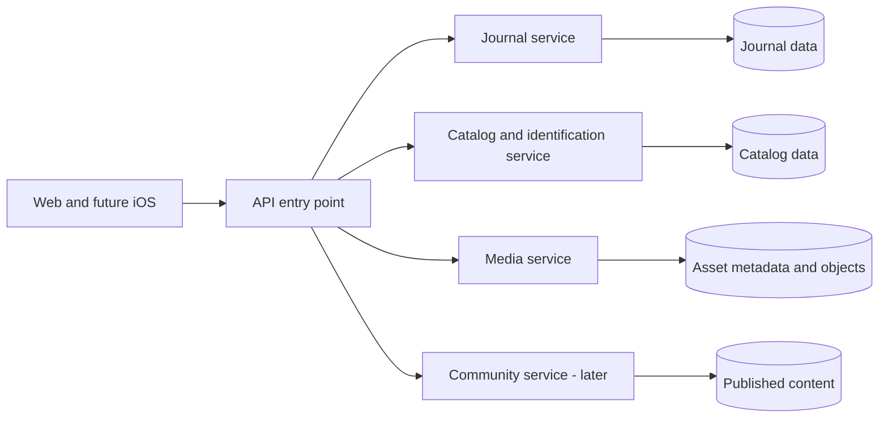

# Architecture alternatives and tradeoff review

Review outcome: the user accepted the modular core and selective supporting-work direction, then authorized scaffolding under `repo/`. See [ADR 0005](decisions/0005-repository-foundation.md). The comparisons below preserve the reasoning and future alternatives; they are not a request to implement every option.

Status: discussion, September 14, 2026. The user requested scrutiny of applicable alternatives for both the portfolio MVP and future product. This review does not select a new stack or start implementation. The baseline remains [architecture.md](architecture.md), including Next.js, a Python modular backend, Supabase, and media workers. Commercial licensing research is not a portfolio delivery gate.

## Separate the decisions

Architecture has several independent dimensions. Comparing “monolith versus serverless versus Clean Architecture” as mutually exclusive choices obscures the actual tradeoffs.

| Dimension | Question | Choices relevant here |
| --- | --- | --- |
| Application ownership | Where are journal rules and permissions enforced? | Python API; Supabase policies/functions; Next server application |
| Deployment boundaries | Which capabilities release and fail independently? | One modular backend plus workers; a few coarse services; fine-grained microservices |
| Internal organization | How do code dependencies stay understandable? | Feature modules with simple layers; stronger domain/ports-and-adapters separation |
| Execution | Which work runs during the request? | Short synchronous transactions; durable asynchronous jobs; hosting in containers or functions |
| State and synchronization | Where does a successful save happen first? | Authoritative server save; durable device capture with later sync; broader local-first replication |

A monolith can have a clean domain model, run on managed/serverless infrastructure, process queued jobs, expose native APIs and serve many concurrent users. Splitting services does not establish those properties by itself. Multiple API worker processes also do not create microservices. [FastAPI deployment concepts](https://fastapi.tiangolo.com/deployment/concepts/)

## Requirements that should determine the boundaries

| Scenario | Required behavior | Architectural implication |
| --- | --- | --- |
| Save wine/date in poor conditions | Minimal input, preserved draft, no duplicate on retry | Small authoritative operation; offline success semantics need an explicit product decision |
| Create occasion with several new entries | Preserve all entries and parent context; no half-saved dinner | Strong transaction boundary around journal creation |
| Change current rating | Current value and history agree; stale changes visible | Serialize/version edits to that personal wine record |
| Upload iPhone media | Entry remains valid while a clip is processing or fails | Durable jobs and separate CPU/memory resources from HTTP handling |
| Recognition is slow/unavailable | Keep manual/text capture usable | External calls outside journal transactions, timeouts and bounded concurrency |
| Show wine highlights and occasion album | One source asset; explicit eligibility and ownership | Relational read queries or derived read models; no upload duplication |
| Later shared occasions | Grant access deliberately and preserve private observations | Contribution/permission model; real-time transport alone cannot supply it |
| Later public discovery | Serve cached catalog/public reviews without revealing private history | Explicit public projections and cache boundary |
| Later iOS | Same identities and rules | Stable client-facing contract; can be Python REST, deliberately designed Next endpoints, or Supabase RPC |

Core journal writes and current authorization need current authoritative state. Media derivatives, recommendations, notifications and public aggregate scores can usually catch up asynchronously with visible status where appropriate. This distinction is more useful than deciding services by tab or database table.

## A. Python modular application plus workers: baseline

Shape: Next/browser/native client → FastAPI → Postgres; durable jobs → media worker → object storage.

Best case: keep Python central, implement cross-record rules in one language, preserve ordinary SQL transactions, and add modules incrementally. It supports all currently requested features without changing deployment style when public reviews or iOS arrive.

Costs: separate TypeScript/Python tooling and API contracts; API authorization must be thorough; shared database capacity and backend releases can become coupling points. A separate API is real maintenance compared with using Supabase directly. Merely putting files in folders does not create effective module boundaries.

What would weaken this choice: Python stops being a learning/product priority, most interactions remain simple CRUD, and maintaining HTTP endpoints becomes a larger burden than database policies/RPCs. Those are grounds to prefer B or C; “more future users” alone is not enough evidence.

## B. Supabase-led application: strongest lean alternative

Shape: Next/browser/native client → Supabase Data API + RLS + database functions; Edge Functions for secret-bearing I/O; a Python worker/service for heavy media or specialized recognition if needed.

Best case: use more of the platform already selected. Managed CRUD, authentication, storage access and realtime reduce custom API plumbing. Transactional journal operations still work: expose a purpose-specific database function such as `save_occasion_with_entries` through RPC. Separate browser requests for each insert would not constitute one transaction. [Supabase database functions](https://supabase.com/docs/guides/database/functions), [PostgREST transactions](https://docs.postgrest.org/en/stable/references/transactions.html)

Costs: business behavior and tests move into SQL functions, policies and edge code. Complex owner/participant/correction rules still need implementation. Avoid directly exposing every table mutation when it could bypass a use-case invariant. RLS must cover reads and writes, related IDs, views and callable functions; privileged functions need narrow execution permissions. This approach can be secure and maintainable when chosen deliberately. [Supabase RLS](https://supabase.com/docs/guides/database/postgres/row-level-security)

It also supports future iOS and collaboration; neither capability requires FastAPI. Stable RPCs/views can reduce client coupling to tables, but moving business rules from SQL/edge code to Python later remains work. This would replace the baseline's disabled Data API/application access model, not be an additional casual bypass around it.

Media remains a separate concern. Hosted Supabase Edge Functions currently have 256 MB memory and two seconds of CPU time per request; waiting on a recognition vendor is different from transcoding a video. Do not assume edge execution is suitable for our FFmpeg pipeline. [Function limits](https://supabase.com/docs/guides/functions/limits)

Choose this if minimizing custom backend work and learning Supabase matter more than implementing the journal in Python. It may reduce operating footprint, but there is no guaranteed dollar saving while all alternatives fit free allowances, and media processing still consumes resources.

## C. Next.js owns the web and application API

Shape: web and explicit native HTTP endpoints → shared TypeScript application services → Postgres; worker for media.

Best case: one main application language and fewer application layers to deploy. The same transactional and privacy rules can live in TypeScript. React/Next does not prevent a native client from calling ordinary authenticated HTTP endpoints.

Costs: gives up Python as the journal backend; care is needed to keep business functions independent of page rendering and avoid treating web-only Server Actions as the native API contract. Heavy jobs still need appropriate infrastructure. Managed-host function limits are deployment constraints; they should not be confused with fundamental limits of JavaScript or Next when self-hosted. [Next backend capabilities](https://nextjs.org/docs/app/guides/backend-for-frontend)

Choose this if the user changes the Python preference and values consolidating languages over a separate backend project. It is a credible monolithic implementation alternative, not an inherently more or less sophisticated architecture than A.

## D. A few independently deployed capabilities

Shape: journal core plus a separately deployed media processor, or later a distinct identification/catalog service. Preserve a cohesive journal transaction boundary.

Best case: isolate unusual resource needs or independently operated workloads. Video decoding can exhaust CPU/memory; recognition may need vendor-specific quotas or eventually a GPU. A public catalog can have different cache/load characteristics from private writes. Separate ownership and rollout become useful when those differences are real.

The baseline's media worker already supplies process/resource separation. A genuinely independent service goes further: its own deployment contract, credentials, owned data, retry semantics and monitoring. Two processes using the same code/schema may be a perfectly good intermediate design; they do not have fully independent lifecycles.

Costs: network and job failures, versioned contracts, results arriving late, duplicate delivery, deletion coordination and additional operational surfaces. Separate code deployments over shared tables still require coordinated migrations. Logical data ownership can share a physical Postgres host, but independent services should not freely update one another's tables. [Service data boundaries](https://learn.microsoft.com/en-us/azure/architecture/microservices/design/data-considerations)

Choose additional service separation when measured resource contention, independent releases, security isolation or team ownership justifies it. The easiest candidate is media/recognition; entries, occasions and private ratings are strongly coupled and should not be the first split.

## E. Fine-grained microservices

Possible shape: separate catalog, entry, occasion, rating, album, profile, review, feed and identity services.

Best case: independent teams own stable business capabilities, have different release cadences, and need distinct scaling or isolation. This could eventually apply to a substantial public discovery product, especially its feed or recommendation workload.

For the current app, several proposed services would participate in one save or gallery read. With independent stores, a new manual wine plus occasion plus entries requires a multi-step workflow and compensation/retry decisions in place of one normal transaction. Reads need composition or replicated summaries. Sharing all tables to retain unrestricted joins undermines much of the deployment independence being sought. [Microservice data considerations](https://learn.microsoft.com/en-us/azure/architecture/microservices/design/data-considerations)

Choose this only for an explicit independent-service learning objective or demonstrated organizational/operating demands. A portfolio project can demonstrate distributed systems that way, but the time/budget tradeoff should be a conscious goal. Publishing to the App Store, adding public reviews, or reaching an arbitrary user count does not by itself require it.

## Concrete microservices candidate for this application

Following acceptance of the internal feature/domain organization, the user asked specifically about distributed service architecture. Keep the agreed stack and organization fixed for this comparison. A defensible service design would use cohesive business capabilities, rather than one service per screen/table:

| Candidate service | Owns | Independence it could provide |
| --- | --- | --- |
| Journal | Personal wine relationships/provisional records, entries, rating revisions, occasions and occasion permissions | A cohesive transaction and privacy boundary |
| Catalog and identification | Canonical releases, external source mapping, matching and catalog enrichment | Provider-specific release cycles, limits and eventually different compute |
| Media | Asset metadata, conversion state, derivatives and object lifecycle | CPU/memory isolation and independent processing capacity |
| Community, later | Deliberately published reviews, moderation state and public-facing activity | Independent public traffic and moderation behavior |

The first two columns describe possible future service ownership, not a change to today's schema. In particular, separating media does not automatically transfer occasion permissions into an asset service. Media must use a deliberate access protocol, and journal links need lifecycle handling rather than assumed cross-database foreign keys. A discovery projection can later consume public community events; it need not be another service at first.

The stores represent ownership, not mandatory separate physical database servers. A single repository is compatible with independent deployments. Kubernetes, a service mesh, multiple languages and a message broker are not defining requirements. A stable entry point does not replace authorization inside each service. [Microservice characteristics](https://learn.microsoft.com/en-us/azure/architecture/guide/architecture-styles/microservices)

Stress-test a sensible service split, not only a deliberately bad one. This design still creates an occasion and its entries in one Journal transaction. The difficult boundaries are elsewhere:

- **Catalog unavailable:** logging a previously recorded wine should use sufficient journal-owned identity/display context; an unknown bottle needs a private provisional record. Later enrichment should not silently move ratings between releases. This adds an explicit reconciliation policy.
- **Journal save succeeds; media completion is delayed:** preserve the saved entry, show Pending/Failed, and retry idempotently. Deleting the entry while processing is underway must prevent a late job from reattaching orphaned media.
- **Public review saved; feed update fails:** the review remains authoritative while a durable event/retry updates the public projection. The UI may temporarily show an older feed.
- **Occasion access revoked:** subsequent authorization checks must use current permissions. Previously issued media capabilities retain their documented expiry behavior. An indefinitely stale ACL copy in another service is insufficient.

The benefits are real when workloads, deployment cycles or security/resource isolation need independence. Costs include network failure handling, contract versioning, service credentials, tracing, distributed integration tests and cross-boundary deletion/reconciliation. A synchronous chain of dependent services can propagate failures; fault isolation requires fallbacks, bounded waits and asynchronous boundaries where appropriate.

Current assessment: a modular journal core and durable media worker capture the strongest immediate benefits with fewer contracts. A small service-based architecture is a reasonable expansion or deliberate distributed-systems learning choice. Fine-grained services remain weakly justified for this product at present. No user-count threshold or App Store requirement alone changes that assessment.

## Complementary patterns worth considering

### Stronger domain separation / hexagonal architecture

An alternative to our lightweight layers is a domain layer independent of FastAPI, SQLAlchemy and vendors, with ports for persistence and integrations. Benefits: isolated rule tests, controlled dependencies, and reuse from multiple entry points. Costs: more interfaces, mapping between domain and ORM models, and abstractions that can simply mirror CRUD.

Use this selectively where rules are complex: release correction/merge decisions, contribution permissions, rating-conflict policies, and external provider mapping. Simple ownership-scoped listing queries can stay in SQLAlchemy. Feature-based organization and layering can coexist; a full project-wide domain/entity/repository/use-case class hierarchy is not required for useful separation.

### Durable jobs and event-driven processing

Use a durable command such as `process_media(asset_id)` for necessary background work. A job is not automatically a general domain-event system. Its database row and the associated asset-state change can commit together; workers must handle retries and expired leases safely.

Later, a public `review_published` event could trigger aggregates, search indexing and notifications. Commit the event/outbox row with the review change before publishing to a broker; otherwise a crash can leave a saved review with no notification, or a notification for rolled-back data. Consumers still need deduplication. A broker is not needed before real consumers exist. [Transactional outbox](https://docs.aws.amazon.com/prescriptive-guidance/latest/cloud-design-patterns/transactional-outbox.html)

Do not put ordinary entry save on an eventually consistent event workflow unless there is a reason users should see Pending rather than Saved. Private events must never automatically become public activity.

### Read models / limited CQRS

Our wine history and occasion album already need different response shapes from the same stored facts. Separate query functions/read DTOs can support those views without a separate database. Later, expensive public feeds or aggregates can use materialized projections with explicit freshness/rebuild rules. CQRS can share one data store; it does not require a broker or event sourcing. [CQRS guidance](https://learn.microsoft.com/en-us/azure/architecture/patterns/cqrs)

Full event sourcing would make the event log the authoritative record and reconstruct state from it. Rating history alone does not justify that change. Replay/versioning and erasure requirements would add work without solving a current gap.

### Containers versus serverless hosting

This is an execution/hosting choice, compatible with several application shapes above. Low, bursty HTTP traffic may fit managed functions well. Compare cold-start behavior, duration, connection pooling, memory, native binaries and billable units before choosing a host. A modular API can run on serverless infrastructure without creating one function per entity.

Media needs available CPU, suitable binaries, temporary disk and durable retries, whether on a container, batch worker or managed job service. A local worker can support a personal demonstration; an unattended public demo cannot promise processing while that machine is offline. Keep the portfolio deployment description honest.

### Offline capture and local-first data

This is a more plausible source of early architecture change than microservices: a restaurant or winery may have poor connectivity. In the follow-up, the user tied the choice to avoiding excessive complexity. The working interpretation is to prioritize simplicity: retain online saves as the MVP baseline, evaluate durable draft recovery separately, and defer automatic offline synchronization. This is a recommendation based on that tradeoff, not a commitment to implement offline saving.

Three levels: an in-memory form; a durable local draft that later needs explicit submission; a locally saved record synchronized automatically. They have different guarantees. Offline-first quick capture can coexist with the Python monolith and does not require collaborative CRDTs.

If offline capture is selected, define device-generated operation IDs, durable local storage, a sync queue, local-versus-server save status, auth expiry, duplicate reconciliation, photo storage/eviction and conflicts. Concurrent edits to a current rating need a policy rather than blindly replaying old mutations over a newer choice. Full local-first replication/coediting is a broader project. [Local-first research](https://www.inkandswitch.com/essay/local-first/)

## How the baseline could fail, and the first response

| Observation | First response | When to change a larger boundary |
| --- | --- | --- |
| Video blocks HTTP requests | Move conversion to the worker and bound CPU/memory/concurrency | Separate deployment/host if resource interference persists |
| Recognition saturates request workers | Provider timeouts, concurrency limits and durable lookup jobs if needed | Dedicated service for distinct hardware, vendor isolation or independent ownership |
| Gallery pages are slow | Inspect query plans, indexes, query count, thumbnails and pagination | Derived read model/cache when measured queries remain costly |
| Public traffic burdens journal writes | Cache public responses; separate public projections from private reads | Independently scale public-serving tier/database reads if evidence warrants it |
| Cross-feature edits are tangled | Tighten module ownership and extract the specific domain rule | Service extraction only after the boundary can be described and tested |
| Multiple developers block one another's releases | Explicit APIs and module ownership first | Independent service releases when team/operating benefits exceed coordination cost |
| Users lose captures without internet | Durable local capture with explicit sync/conflict semantics | Broader local-first design if offline collaboration becomes central |

These are decision triggers, not measured bottlenecks or a commitment to evolve toward microservices. The modular application may remain the right long-term design.

## Review outcome and next decisions

The current evidence still favors **a modular Python application with transactional journal writes, explicit public/private read boundaries and asynchronous media processing**. The strongest alternative is Supabase-led journal behavior, followed by a consolidated TypeScript backend if the Python preference changes. Selective service isolation remains available in either design.

Keep the recommendation falsifiable. Before implementation, walk through one multi-wine save and one cross-account media request under A and B and identify exactly where each invariant is enforced. Keep online saves and any draft-recovery guarantee explicit in capture persistence; clarify later collaboration as shared attachments versus simultaneous text editing before selecting realtime/sync technology. No arbitrary traffic target or adoption statistic substitutes for those decisions.

Scope of evidence: sources establish platform capabilities and architectural tradeoffs. The comparison, priorities and extraction triggers are our project-specific reasoning. No deployment benchmark or provider integration was performed in this review, and no architecture ADR has been marked Accepted by it.

## Long-term client architecture assessment

The user subsequently requested a recommendation for the complete long-term product, setting aside MVP delivery constraints. This assessment assumes the described private journal, shared occasions, public reviews, discovery, media and web/native clients are active product capabilities. Traffic, team ownership, availability targets and geographic requirements remain unspecified; the following defines the preferred logical architecture, not a benchmarked deployment size. It does not authorize implementing future features or purchasing services.

For that full product, recommend a **domain-oriented service-based architecture with a transactional journal core and asynchronous processing**. Use a few cohesive capability boundaries. These can be implemented as coarse-grained microservices; fine-grained services per entity are not required. Domain boundaries and deployment units are related decisions, but not identical ones. Domain analysis should precede service sizing. [Domain analysis](https://learn.microsoft.com/en-us/azure/architecture/microservices/model/domain-analysis), [bounded contexts](https://martinfowler.com/bliki/BoundedContext.html)

| Capability boundary | Authoritative responsibilities | Consistency and interaction |
| --- | --- | --- |
| Journal and shared occasions | Personal wine records, entries, occasion membership/context, personal ratings/history, private notes and attachment associations | Transactional writes and current access decisions; one cohesive owner even when several modules implement it |
| Wine knowledge | Canonical wine/release identity, source mappings, enrichment and reference content | Stable identifiers and explicit correction contracts; journal can retain minimal display context and provisional records during outages |
| Media | Binary assets, technical metadata, validation, derivatives and processing lifecycle | Durable asynchronous work; receives explicit authorization/attachment intent from the owning domain, never infers public visibility |
| Community | Deliberately published reviews/ratings, public profiles, moderation and publication lifecycle | Authoritative publish/edit/unpublish operations; separate public model from private journal records |
| Discovery | Search projections, suggestions, taste-derived recommendations, trending and ranking | Derived state with defined freshness and rebuild behavior; consumes authorized private preference inputs separately from public activity |

Identity is a supporting managed capability; product-specific sharing permissions belong with the domain that controls the content. Notifications are asynchronous delivery of already-recorded actions, not the owner of invitations or publication state.

A defensible long-term deployment would give media processing its own execution resources, independently operate public discovery processing/serving when workload warrants it, and expose stable interfaces for Journal, Wine Knowledge and Community. Whether those three business boundaries immediately run as separate applications is a client operating decision. A single modular deployment can enforce the same ownership model; a client needing independent releases or isolation can deploy them separately without redesigning their public contracts. Actual extraction still requires data movement, reference reconciliation, permissions and migration work.

The reason for this design is the product's mixed requirements: private transactional records, shared catalog facts, expensive asynchronous media and derived/public discovery. It is not a presumed progression from a small monolith to many microservices. The Journal boundary is intended to remain cohesive long-term.

### Decisions to establish before implementation

1. Stable identity for wine definitions/releases and explicit correction/merge behavior; do not use a provider ID, label text or barcode as the whole application identity.
2. Separate personal current ratings/revisions from public opinions/aggregates. Publishing copies/selects deliberate content rather than making a private row public.
3. Explicit owner, contributor and viewer semantics for occasions and attachments. Private preference processing does not authorize public disclosure.
4. Domain ownership of writes and versioned interface contracts. Avoid turning shared ORM entities or unrestricted cross-domain table writes into permanent integration mechanisms.
5. Transaction boundaries for journal saves and rating changes. Cross-domain work uses idempotent operations and reconciliation; media/derived feeds may finish later.
6. Durable asynchronous delivery where a saved change must trigger work; store pending work/outbox intent with the authoritative state and tolerate duplicate delivery.
7. Server-authoritative online saves as the current product baseline, with any future offline sync guarantee and conflict semantics made explicit. Native distribution alone does not imply automatic offline synchronization.

These decisions are generally more expensive to reverse than moving cohesive code between processes, although process extraction is still material engineering work. Folder names and early deployment topology should follow these boundaries rather than substitute for them.

### What could change the recommendation

Multiple independently releasing teams, stringent fault/security isolation or sharply different compute demands strengthen the case for physically separate services. A cohesive team and moderate operating demands strengthen the case for retaining several contexts in a modular application. Mandatory simultaneous offline collaboration would require a deeper synchronization design. Multi-region write availability would require additional data/consistency analysis. None of these conditions is established by the current functional description, so they should not be invented to justify infrastructure.

The known functions justify the recommended domain boundaries and asynchronous workloads. Final client deployment topology needs agreed latency/availability, recovery, media volume, region, team and operational ownership targets. This assessment adds a long-term target without replacing the accepted code organization or prematurely marking the deployment proposal Accepted.
