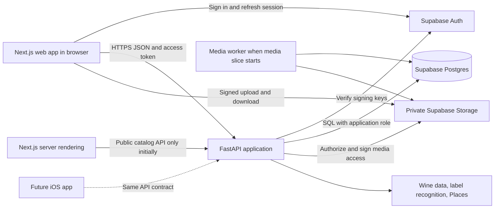

# Wine Journal architecture

Status: accepted architectural direction with an initial repository scaffold, September 14, 2026. [ADR 0005](decisions/0005-repository-foundation.md) records the user's authorization and the choice of `repo/` as the Git root. Detailed domain schemas and integrations remain planned; no paid or hosted service has been provisioned.

The user has accepted feature/domain modules, lightweight internal layers and explicit dependency boundaries, with a cohesive transactional Journal core and selective asynchronous supporting work. Logical domains do not each require a separate deployment. Hosting may use persistent or serverless execution without changing these ownership boundaries.

The [architecture alternatives review](architecture-options.md) tests this baseline against a Supabase-led backend, a consolidated Next application, coarse services and microservices, plus offline and asynchronous processing choices. It is a discussion document; alternatives do not replace this proposal without an explicit decision.

Product authority: [story map](../tasks/story-map.md), [occasion journeys](../tasks/occasion-journeys.md), [wine identity research](../tasks/wine-identity.md), and [latest UX decisions](../tasks/ux-review-04.md). Supporting design: [data model](data-model.md), [API contracts](api-contracts.md), [current frontend decision](decisions/0004-nextjs-and-portfolio-budget.md), and [delivery tasks](../tasks/todo.md#proposed-implementation-sequence).

## Recommendation

Use one Next.js/React web application and one Python application organized by feature, backed by Supabase Postgres, Auth, and private Storage. Keep journal rules in Python and relational constraints in Postgres. The backend is a **modular monolith**: business modules share a database and deployment, while their responsibilities remain clear. The overall system has a web presentation tier, an application API tier, and a persistence tier; these logical tiers do not imply three dedicated machines.

The MVP needs reliable relationships, private media, correctable identification, and a polished mobile experience. It does not yet need independently deployed business services, a recommendation model, or a general collaboration platform. Add those capabilities in response to a concrete product need.

### Architecture paradigm and justification

Use a **modular monolith with feature-oriented organization and lightweight layers within each feature**. Routes handle transport and validation; service functions coordinate authorization, business rules and transactions; SQLAlchemy handles persistence; concrete adapters isolate external APIs. Deliver features as vertical slices across UI, API and data. Vertical slicing is a delivery/organization practice here, not a claim that every use case needs a separate class hierarchy.

For example, saving an occasion with three new wines calls the journal service once. It checks ownership, resolves the selected identities, and commits the occasion and entries in one Postgres transaction. Feature services called inside that operation share its session and do not commit independently. Provider calls and media processing stay outside the transaction.

This fits one developer: straightforward local debugging, one backend release, ordinary joins and transactions, and a feature's related files kept together. Public reviews can become another module; iOS can use the same API; media processing can scale separately. Those extensions still require implementation and migrations. A module is not automatically ready to become an independent service.

We borrow domain language and external-service boundaries without adopting a full DDD, Clean Architecture, or hexagonal class structure. Service functions may use SQLAlchemy directly, so this is not strict dependency inversion. Rating revisions are ordinary history records, not event sourcing. Read queries and writes share the same database; no CQRS infrastructure is planned. Tradeoffs: changes share a backend deployment, and module discipline must prevent circular imports and unrestricted cross-feature writes.

## Stack and rationale

| Responsibility | Proposed choice | Why it fits this project |
| --- | --- | --- |
| Web interface | Next.js App Router, React, TypeScript | Interactive private journal plus a rendering path for public wine pages, guides and later reviews |
| Navigation | Next.js filesystem routing | Thin route/layout files compose feature screens; no additional React Router |
| Server data in the browser | TanStack Query | Loading/error states, caching, invalidation after edits; avoids a second hand-written server-state store |
| UI and forms | Tailwind CSS, selected shadcn/ui primitives, React Hook Form | Implement the established burgundy/olive/cream design, accessible dialogs, and nested capture forms; add Zod only where form validation benefits from it |
| Application API | FastAPI, Pydantic | Python use cases, input/output validation, documented REST contract usable by web and iOS |
| Database access | SQLAlchemy 2, psycopg, Alembic | Relational queries, explicit transactions, one reviewed application migration history |
| Database | PostgreSQL hosted by Supabase | Foreign keys, constraints, transactions, and queries joining releases, entries, occasions, and media |
| Authentication | Supabase Auth | Managed identity and sessions; Python still authorizes every journal operation |
| Media | Supabase private Storage | Direct authorized uploads; database stores references and metadata rather than media bytes |
| Verification | pytest; focused React tests with Vitest/Testing Library; Playwright journeys | Protect data rules, authorization, form recovery, and the real browser experience |
| Tooling | uv for Python, npm for web; Ruff, Python type checking, TypeScript/ESLint | Familiar tools with committed lockfiles and reproducible checks; no monorepo orchestration service required |

Pin supported stable versions when implementing and commit lockfiles; this plan does not prescribe speculative version numbers. The exact OpenAPI TypeScript generator is an implementation choice, with FastAPI's schema as the source of truth. [FastAPI client generation](https://fastapi.tiangolo.com/advanced/generate-clients/)

### Frontend decision: Next.js from the start

The Vite recommendation over-weighted immediate runtime simplicity. Under the user's clarified priorities, choose Next.js now: public wine pages, reviews and guides are meaningful expansion goals, and avoiding a later routing/rendering migration is worth modest framework learning. Keep FastAPI as the sole application backend. Next.js renders the web interface; it does not duplicate database access or journal rules.

There is no demonstrated dollar saving from Vite at portfolio scale. Both choices can use free frontend hosting within quotas; Vercel Hobby currently supports personal noncommercial projects. Python, database, storage and recognition costs remain in either case. Vite's benefit is fewer server/client rendering concepts and a more portable static deployment. Next.js supplies conventions we would otherwise add or migrate toward. [Vercel Hobby](https://vercel.com/docs/plans/hobby), [React framework guidance](https://react.dev/learn/creating-a-react-app)

Vite-to-Next migration is feasible in stages: keep components and the API, adjust build/environment configuration, then migrate routes, links, loading/error boundaries, browser-only code and any server data/auth/cache behavior. Wrapping the SPA in Next is easier than actually gaining server-rendered public content. For a small completed MVP, budget several focused days rather than a configuration-only change; this is an engineering estimate with no implemented codebase to measure. [Official migration guide](https://nextjs.org/docs/app/guides/migrating/from-vite)

Recommend a normal Next deployment on a compatible free host, initially Vercel Hobby, rather than `output: 'export'`. Next supports static export, but newly created private paths such as `/my-wines/[id]` cannot all be enumerated at build time; static export would require route compromises. No always-on paid Node VM is required on a managed host, although server execution has quotas. [Static-export limitations](https://nextjs.org/docs/app/guides/static-exports)

Keep authenticated journal data client-fetched from FastAPI with bearer tokens and TanStack Query initially. Public server-rendered catalog pages may fetch the public API; private data must never enter a shared page cache. A UI route guard improves navigation but FastAPI enforces access. Do not add Server Actions, a general Next proxy/BFF, or duplicate query caches without a concrete need. iOS reuse depends on our API boundary, equally with Vite or Next.

This direction is recorded in [ADR 0004](decisions/0004-nextjs-and-portfolio-budget.md) and accepted in [ADR 0005](decisions/0005-repository-foundation.md); [ADR 0001](decisions/0001-application-shape.md) retains the previous proposal. The scaffold contains a startup screen and liveness API; the remaining runtime integrations below are implementation plans.

### PostgreSQL and Supabase are different decisions

Postgres is a good fit because one occasion can contain many entries, a release can recur across many occasions, and ratings and media have independent lifecycles. Transactions and relational constraints protect these relationships. [PostgreSQL constraints](https://www.postgresql.org/docs/current/ddl-constraints.html)

Supabase supplies a managed Postgres instance plus identity and storage services, matching the user's learning preference and reducing operations work. Standard SQL migrations preserve database portability; replacing authentication and storage would still require migrating users, objects, and integration code. There is no automatic zero-effort provider switch. See [ADR 0002](decisions/0002-supabase-and-data-access.md).

## System layout



Deploy the Next.js web app, one containerized API, and one Supabase project initially. Add a small worker process from the **same Python image** when media validation/derivatives need durable work. For local portfolio demonstrations this worker can run on the development machine; a hosted upload flow needs somewhere available to process its jobs. It is a different process for resource isolation, not another business service. No Redis, Celery, Kubernetes, Elasticsearch, or vector database is required by this design.

## Responsibilities and dependencies

| Module | Owns | Key boundary |
| --- | --- | --- |
| `accounts` | App user identity, account status, export/deletion coordination | Auth provider authenticates; app controls access and lifecycle |
| `catalog` | Wine definitions/releases, source references, manual records, corrections | Public sourced records and owner-only provisional records have explicit visibility |
| `identification` | Barcode/photo matching, candidate normalization, provider limits | A result is a candidate identity, never a drinking entry |
| `journal` | Personal wine records, entries, rating revisions, occasion operations | One transaction can create an occasion and its entries |
| `media` | Asset lifecycle, attachment authorization, derivatives and cleanup | Covers, entry memories, and general occasion memories are separate attachments |
| Catalog and journal query files | Basic catalog browse and private profile respectively | Start inside their owning features; add `discovery` only when recommendations/public discovery justify a distinct module |
| Journal place routes + `integrations/places.py` | Optional official-place lookup and provider mapping | A small adapter and route file suffice; free-text locations work independently |

Start `journal` with ordinary files for entries, ratings, and occasions as they grow; these do not need independent service layers. API routers validate and call use cases. Use cases own authorization and transaction boundaries. SQLAlchemy queries live beside the feature using them; extract a `queries.py` when substantial. Create provider adapters only around real external dependencies. Do not add a generic repository, event bus, dependency-injection framework, or empty interfaces for hypothetical vendors.

For the initial API, use synchronous SQLAlchemy sessions and synchronous database route handlers. One request/use case gets one session; it is never shared concurrently. Keep provider network calls outside database transactions, set timeouts, and close sessions reliably. FastAPI runs ordinary synchronous handlers in a thread pool; blocking libraries must not be called directly inside asynchronous handlers. Revisit asynchronous I/O after measuring a need. [FastAPI concurrency](https://fastapi.tiangolo.com/async/), [SQLAlchemy sessions](https://docs.sqlalchemy.org/en/20/orm/session_basics.html)

## Proposed folder structure

All paths below are relative to `repo/`, the Git root explicitly chosen by the user. The [repository README](../README.md) describes the files that exist now. This target layout also includes files added with later slices, such as migrations, session helpers, providers and the worker; those are not implemented placeholders.

```text
repo/
  README.md                     # Project overview and actual run commands once implemented
  docs/
    architecture.md
    data-model.md
    api-contracts.md
    decisions/                  # Short, numbered architecture decisions
  tasks/                        # Product stories, research, UX reviews, delivery tasks
  design/                       # Existing Stitch source and disposable prototypes
  apps/
    web/
      package.json
      package-lock.json
      src/
        app/                    # Next routes/layouts/loading/errors; thin composition
          (public)/             # browse, wines/[releaseId], guides
          (journal)/            # my-wines/[userWineId], occasions/[occasionId]
          auth/                 # Sign-in/callback pages
          layout.tsx
          providers.tsx         # Client Query/Auth provider boundary
        features/
          auth/
          browse/
          capture/              # Shared wine-first and occasion-first draft flow
          my-wines/
          occasions/
          guides/
          profile/
        components/             # Shared bottle cover and media gallery
          ui/                   # Shared shadcn/base UI primitives
        lib/
          api/                  # Generated transport types/client plus small auth wrapper
          auth.ts
          query-client.ts
        content/guides/         # Small sourced editorial collection
        styles/                 # Semantic design tokens and global styles
      tests/e2e/
    api/
      pyproject.toml
      uv.lock
      src/wine_journal/
        main.py                 # Application assembly only
        core/                   # Settings, DB session, verified identity, errors, logging
        accounts/
        catalog/
        identification/
        journal/
        media/
        integrations/           # Supabase storage, wine/recognition/Places clients
        worker.py               # Added with media processing
      migrations/               # Alembic: sole application schema migration history
      tests/
        unit/
        integration/
      Dockerfile                # Added when container execution is configured
  contracts/openapi.json        # Generated, reviewable API contract snapshot
  supabase/config.toml          # Local Auth/Postgres/Storage configuration
  scripts/                      # Small contract/export/bootstrap helpers when needed
  .github/workflows/            # CI when implementation starts
  apps/*/.env.example           # Per-runtime names and safe examples only
```

A typical backend feature grows `routes.py`, `schemas.py`, `models.py`, and `service.py` as needed; do not generate four empty files for every concept. A React feature colocates its screen, components, query hooks, and focused tests. `app/` defines URL/layout composition; `features/` implements the experience; `components/` contains actual shared UI; `lib/` contains transport/auth infrastructure. Avoid giant project-wide `services/`, `models/`, or `utils/` directories. Do not mirror database tables one-for-one into frontend feature folders. Next permits this organization around its route conventions. [Next project structure](https://nextjs.org/docs/app/getting-started/project-structure)

Keep the root simple: `apps/web` and `apps/api` give the two runtimes clear tool/test boundaries in one repository, without requiring Turborepo or a workspace framework. If we preferred top-level `frontend/` and `backend/`, that would work too; `apps/` is useful here because a native app is a real future possibility. No arrangement is universally best. The practical test is whether a rating change mainly touches the journal feature and its web screen rather than scattered global folders.

Dependency rules: route files call feature services/screens; shared infrastructure does not import product features; features use another feature's explicit operations rather than reaching through internal files. Journal use cases coordinate catalog/media references and shared transactions. Extract genuinely shared logic only after concrete reuse. Begin private profile queries inside `journal/` and browse queries inside `catalog/`; do not create separate backend folders solely because the UI has a tab.

Keep generated client code inside the web app initially. Extract a shared `packages/api-client` only when a second TypeScript client exists. A future native app would live at `apps/mobile/`; do not create it now. Do not ship prototype fixtures or Stitch import HTML as application source.

## Frontend state and UX contracts

- Routes: `/browse`, `/wines/:releaseId` for public catalog; `/my-wines`, `/my-wines/:userWineId`, `/occasions`, `/occasions/:occasionId` for private records; `/guides` and `/guides/:slug`. Preserve Browse Wines / My Wines / Occasions / Guides navigation order. Signed-in journal landing remains My Wines.
- Private server state belongs to TanStack Query; public server-rendered pages use explicit Next fetch/cache policy for public data. Search/filter/sort belongs in URL parameters; transient forms belong to a capture draft reducer/form state. Do not mirror the same data into Redux or hydrate/cache every response through both Next and Query by default.
- Wine-first and occasion-first capture use the same wine selector, date/place fields, and media picker. Nested navigation returns to the parent draft. Cancelling a draft does not create journal records.
- Before auth redirects, preserve an explicitly pending capture draft locally with a short expiry and clear it after completion/cancel. Do not persist auth tokens yourself or persist the whole journal cache. File blobs may require reselection after a redirect; warn before leaving and preserve textual input. Full offline sync is later scope.
- Private query keys include the account identity; clear private caches on sign-out/account change. Serve private API responses with `Cache-Control: no-store`. Public catalog responses never include private overlays.
- Use a semantic token layer for burgundy actions, olive secondary accents, warm neutral surfaces, and readable text. Preserve accessible contrast, visible focus, descriptive labels, reduced-motion support, touch targets, and mobile overflow behavior. Query/page loading, empty, error, upload-progress, and retry states are part of each feature.
- Start guides as reviewed Markdown plus small typed metadata in the web code. Sanitize rendered content and keep authoring trusted. A CMS and personalized curriculum can wait.

## Data access and privacy

Browser code talks to Supabase Auth and signed Storage URLs, but journal reads/writes go through FastAPI. Put application tables in an unexposed `app` schema, disable the Supabase Data API if unused, and grant no direct journal access to `anon` or `authenticated`. Use a least-privileged database runtime role; use a separate migration role. Direct SQL access and the Data API have different security models. [Supabase data access](https://supabase.com/docs/guides/database/secure-data)

Validate access tokens against the configured project's asymmetric signing keys, expected issuer/audience, expiry, and an allowed algorithm. Resolve the verified subject to an active application user. Cache signing keys with rotation-aware expiry. Do not trust a submitted owner ID or merely decode a JWT. [Supabase JWT verification](https://supabase.com/docs/guides/auth/jwts)

FastAPI must scope every lookup and write to that user, including nested IDs, media, provisional wines, and linked occasions. SQLAlchemy does **not** automatically inherit the caller's Supabase RLS identity. This baseline relies on an inaccessible application schema, constrained database roles, API authorization, and cross-account integration tests. Application-table RLS can be added as defense in depth with explicit transaction-local identity and tests; it is not an assumed existing guarantee.

Private Storage access is a separate boundary. Ordinary clients receive no broad object-list/read/write policy in this API-mediated design. The backend storage adapter has signing/admin capability, checks app ownership first, and returns scoped capabilities. Keep its secret out of frontend bundles and logs. Signed download URLs are bearer links usable by anyone possessing them until expiry; propose five-minute download links and refresh on demand. [Private buckets](https://supabase.com/docs/guides/storage/buckets/fundamentals)

Use HTTPS, a restrictive CORS origin list, request/body limits, a CSP compatible with the chosen auth/media endpoints, and escaped plain journal text. Do not log notes, private place labels, media bytes, tokens, or signed URLs. Disable an account in the app before asynchronous deletion so an otherwise valid access token cannot continue using the journal.

## External dependencies and media

Portfolio priority: use the leanest available route, with local development, free tiers and a small curated demonstration catalog where useful. Commercial licensing procurement/research is deferred to a broader distribution or commercial phase and does not block building the journal. Check practical endpoint access, free quotas and basic source requirements when connecting an actual provider; no paid catalog contract is assumed.

A barcode decoder reads digits; a data source maps those digits to possible wines. Codes may span vintages. Photo recognition proposes candidates; it does not establish unobserved facts. Preserve freshness, ambiguity, and a text/manual recovery path. Check a small representative set before claiming coverage, and label simulated/limited demo lookup honestly. Recognition coverage and potential usage charges remain technical constraints even for a portfolio.

Expose guest lookup with bounded requests, rate limits, and a global spend ceiling. A single-instance limiter is acceptable during a controlled local demo; before an internet demo, enforce shared limits at the gateway or in a database-backed counter so restarts/workers do not reset paid-provider protection. Start with synchronous, time-bounded recognition and explicit retry; add durable identification jobs only if the provider requires them. Do not hold a SQL transaction while waiting for a provider.

Private photos and bounded videos are in the planned MVP. Add a small Postgres-backed job queue with the media slice: transactions enqueue validation/derivative work, and a worker claims jobs with leases, retries, and deduplication. Delivery is at least once; each handler must tolerate re-execution. A stopped API process must not lose the work. CPU-heavy decoding/transcoding runs in the worker with resource limits.

Proposed media flow: request upload permission → upload to a random staging object → notify completion → validate actual bytes/type/size and decode safely → make thumbnails/playable derivatives → mark ready → show in the journal. Strip embedded location metadata from displayed derivatives; keep any retained original private and settle original-retention policy with storage limits. Entry saving does not depend on successful media processing. Failed/abandoned objects get cleanup jobs. Only ready assets receive viewing links; raw unvalidated uploads never become covers or album content.

Signed upload URLs currently have a two-hour provider lifetime, so use immutable paths, disable overwrite, and validate again after upload; a shorter app draft expiry does not revoke an issued capability. Cleanup must account for uploads arriving after cancellation. Exact byte/duration/account quotas and iPhone HEIC/HEVC handling are an early media feasibility decision. The prototype's local-file limits are not production policy. [Supabase signed uploads](https://supabase.com/docs/reference/javascript/file-buckets-createsigneduploadurl)

### iPhone media is a compatibility requirement

Accept common iPhone HEIF/HEIC photos and HEVC/H.264 video in supported MOV/MP4 containers within explicit limits. Inspect actual streams and image formats; a `.mov` extension is not a codec. Do not rely on iOS/browser uploads automatically converting them. Apple documents high-efficiency formats and conversion behavior. [Apple media formats](https://support.apple.com/en-us/116944)

Produce resized JPEG/WebP images and an MP4 playback derivative using H.264 video and AAC audio, with a poster and seek-friendly metadata. Use FFmpeg/ffprobe in the Python worker for video inspection/conversion, and a HEIF-capable image decoder for photos. Test the chosen binary builds on real samples. Preserve orientation and aspect ratio, normalize HDR to a suitable SDR output when required, and test muted/inline playback behavior. These are compatibility tasks, not a reason to defer iPhone support. [FFmpeg](https://ffmpeg.org/ffmpeg.html), [browser codec guidance](https://developer.mozilla.org/en-US/docs/Web/Media/Guides/Formats/Video_codecs)

Keep cost bounded: a short clip limit and account quota, one playback rendition plus poster, and no adaptive-streaming service initially. Proposed playback output is up to 1080p/30fps; exact input byte/duration limits follow sample testing. Free upload limits can reject high-bitrate 4K clips before server compression is possible, so provide a clear trim/export recovery path and select samples/limits deliberately. Do not promise arbitrary original uploads on a free tier. Prefer server/local-worker conversion over large browser FFmpeg/WASM downloads. A free library still needs CPU time, disk and storage to run.

Locations store an optional personal label and, for official places, a provider ID. Google permits storing place IDs but restricts storage of other Places content and requires attribution. Do not treat provider addresses/photos as freely reusable catalog data or evade restrictions by relabeling them as user text. Keep custom locations useful without a provider. [Places policies](https://developers.google.com/maps/documentation/places/web-service/policies)

## Local development, deployment, and operating cost

Use the Supabase CLI local stack with its container dependency for production-like Auth/Postgres/Storage behavior; run Python and Next locally for fast reload. A small local Postgres-only setup is sufficient for database tests, but does not validate auth/storage integration. Keep separate local and hosted configuration and no production personal data in fixtures. [Supabase local development](https://supabase.com/docs/guides/local-development)

Alembic owns application tables, indexes, and application grants. Do not also generate Supabase SQL migrations for those tables. Version local service settings and an idempotent private-bucket bootstrap separately; manage provider-owned schemas through supported APIs. Test migrations from an empty database and a representative previous schema. Run migrations once per deployment, not on every API worker startup.

Use a persistent API container with a small SQL connection pool. Supabase recommends direct connections for persistent backends where networking supports them; use the shared session pooler for IPv4-only hosting. Avoid choosing the transaction pooler by default, and budget total connections across processes. [Connection guidance](https://supabase.com/docs/guides/database/connecting-to-postgres)

Free Supabase is suitable for learning and an early controlled demo: the current plan lists 500 MB database space, 1 GB file storage, 5 GB egress, inactivity pausing after one week, and no automatic backups. Free image transformations are also unavailable. Those constraints matter particularly for private video and a portfolio link expected to stay responsive. [Pricing checked September 14, 2026](https://supabase.com/pricing)

Budget direction is now explicit: prioritize zero recurring service spend for the portfolio, use local development and free tiers, and revisit paid services only when a concrete need warrants it. Vercel Hobby is the proposed web host; choose Python/worker hosting by actual free resource/runtime limits. Free database hosting does not cover arbitrary compute, recognition, Places, email delivery, or media traffic. Model usage before enabling billed integrations and keep a manual/local demo path. Start with one hosted environment and local development; add hosted staging when needed.

Before inviting anyone to rely on the journal, automate off-provider database backups and storage-object backups, then test a restore. A database dump alone does not preserve photos/videos. Proposed early target: daily backup with up to 24 hours of data loss, and restoration within one working day; these are review targets, not a promised SLA. Retention and account deletion must include backups under a documented expiry policy.

CI should run formatting/lint/type checks, backend rules and Postgres integration tests, contract-generation drift checks, a frontend build, and a few critical browser journeys. Deploy after checks, run a health/readiness smoke check, and retain the previous image/build for rollback. Schema changes should be additive where needed to support that rollback. No production availability target is agreed yet.

Record request IDs, error rates, provider latency/cost/fallback rates, upload failures, queue age, storage usage, and database health without private content. Suggested performance review targets: common journal API reads below 500 ms p95 at modest demo load (excluding cold starts/providers), no repeated per-card database/media requests, and lazy-loaded thumbnail galleries. Benchmark on real phone capture and a defined dataset before claiming success.

## Expansion paths and triggers

| Need | Planned extension | Trigger |
| --- | --- | --- |
| Native iOS | New Swift or Expo/React Native client using the same API, Auth and media protocol | Mobile web limitations or evidence that native distribution helps; UI/camera code is not automatically reusable |
| Public reviews | Explicit public review/rating records, publication preview, reporting and moderation | Private MVP validated and public behavior scoped |
| Shared occasions | Invitation/membership and contribution permissions; deliberately shared attachments | Collaboration phase with clear owner/participant rules; current private data stays private |
| Similar wines | Explainable catalog attributes and current-rating preferences | Enough reliable metadata; guide views and repeat drinking are not assumed likes |
| Trending | Aggregate deliberate public activity with distinct contributors and sample thresholds | Real public participation; never fabricate trends from seed data |
| Search | Postgres indexes, then measured fuzzy/full-text needs | Search quality/query plans show a gap; separate search service only if Postgres becomes inadequate |
| Public SEO | Extend Next server/static rendering and metadata for public routes | Public landing/review discovery grows; no frontend-framework migration required |
| More load | Tune queries/pools; scale API and media worker independently | Observed latency, connection pressure, or queue backlog |

The main remaining implementation choices are free provider access/coverage, first retail market, concrete media limits, initial sign-in method and exact rating scale/removal UX. The budget direction is lean/free and iPhone compatibility is required. Commercial licensing analysis is deferred rather than a portfolio delivery gate.
