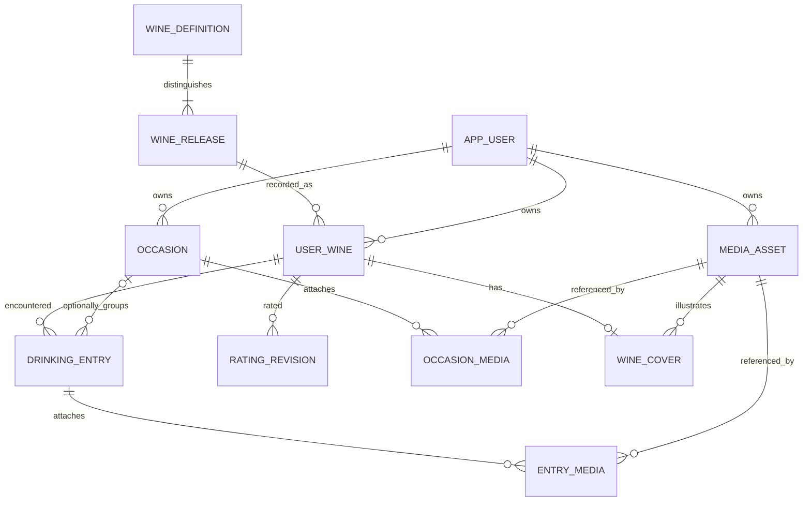

# Wine Journal data model

Status: proposed logical model, September 14, 2026. This is not migration SQL. Exact fields are added with their feature slices. Identity examples and terminology follow [wine identity research](../tasks/wine-identity.md); architecture and access policy are in [architecture.md](architecture.md).

## Core relationships

A wine definition is a named offering, such as a producer's specific Cabernet selection. Its releases distinguish vintage, edition, or non-vintage batch where known. A **user wine** is one person's record of one release. A physical bottle or glass is not an inventory entity in this MVP.

## Principal records

| Record | Important fields and rules |
| --- | --- |
| `app_users` | UUID; unique `(auth_issuer, auth_subject)`; account state; display preferences. No passwords. Journal ownership uses this app ID. |
| `wine_definitions` | UUID; recognizable name; producer, country/region and style where known; controlled grape codes as an array initially; nullable `owner_id`. Null owner means approved shared catalog; otherwise owner-only provisional identity. |
| `wine_releases` | Definition FK; `vintage_status` (`YEAR`, `NON_VINTAGE`, `MULTI_VINTAGE`, `UNKNOWN`); year only for `YEAR`; optional edition/batch; sourced ABV and descriptive facts where available. Inherits definition visibility. |
| `user_wines` | Owner FK; release FK; unique `(owner_id, release_id)`; optional personal summary note; nullable current rating in integer half-star units; rating version; created/updated timestamps. Created on deliberate save, never on lookup. |
| `drinking_entries` | Owner; user-wine FK; required `consumed_date`; optional local time and IANA timezone; optional place fields; free text and optional guided descriptors; nullable occasion FK; revision/version. Same-date repeats are valid. |
| `occasions` | Owner; optional title; required occasion date as the proposed minimum for an explicitly saved occasion; optional time/timezone/place; general notes; version. Display a date-based fallback when untitled. |
| `rating_revisions` | Owner; user-wine FK; unique `(user_wine_id, version)`; nullable score; server change timestamp. Nullable score records clearing the current rating. Not a drinking entry. |
| `media_assets` | Owner; random storage keys; kind; detected MIME; byte size; dimensions/duration; processing state; derivative keys; timestamps. Store no expiring signed URL as permanent data. |
| `entry_media`, `occasion_media` | Typed foreign keys to parent and asset, owner, caption and ordering. Each parent/asset pair is unique. They identify context, not a copy of the stored object. |
| `wine_covers` | One row per user wine; asset FK; owner. It does not make the asset an album memory. |

The proposed score representation is 1–5 in half steps, stored as integers 2–10 to avoid floating-point comparisons. The prototype uses that scale, but the user has not finalized it; settle before the rating migration. `null` means unrated, never zero. Free-text wine summary notes are optional; encounter observations remain on entries.

Provisional wine identity requires only a recognizable user-entered name; producer, year, region, and other facts can be unknown. Manual creation makes an owner-only definition/release, even when a similar shared offering exists. This small amount of duplication avoids silently inserting incomplete claims into public catalog data. An unknown-vintage record is not the same as a verified non-vintage release.

## Identity, corrections, and sources

Use UUIDs for identity, not a name, barcode, or `(name, year)` key. Catalog source mappings can identify a definition or a release; one code can map to several candidates. Store normalized GTIN plus its provenance in a barcode mapping table with explicit definition/release targets and a constraint requiring exactly one target. Do not impose one globally unique release per barcode. Validate checksums/format separately from catalog matching.

Source references record provider, external ID, retrieval time, attribution, and the intended definition/release. Persist only permitted normalized fields; retain raw payloads only when licensed and operationally necessary, with expiry. If fields have different sources, preserve their provenance. Offers need amount, currency, source, market and observed time; unknown price/availability stays unknown. Personal label uploads are never silently republished as catalog artwork.

Correction cases must be separate commands:

1. **Edit private provisional facts:** validate ownership; affect only that owner's identity. Show when this identity has multiple entries.
2. **Move one misidentified entry:** select/create its correct user-wine target; preserve entry ID, consumed context, notes, attachments and occasion. Its old wine rating stays with the old user-wine record.
3. **Resolve an entire provisional record:** if no destination user-wine exists, retarget the personal record after explicit confirmation. If the owner already has the destination, preview a merge. Preserve entries and media; keep the source rating history available and require a choice of current rating. Do not combine histories into an invented chronological opinion or overwrite either current rating silently.

The full merge tool can follow initial correction support. Until then, offer entry-by-entry correction and keep a conflicting source record accessible. No auto-merge on a matching label/name and no public-catalog editing endpoint for ordinary users.

## Database invariants and query design

- Use foreign keys, required fields, check constraints, and explicit uniqueness. Validate release visibility when creating a personal record. Restrict delete of a release referenced by a journal.
- Duplicate owner IDs on child rows support authorization and **composite foreign keys** such as `(owner_id, user_wine_id)` and `(owner_id, occasion_id)`. Add the corresponding parent unique keys so mismatched-owner references fail in the database. Apply the same pattern to media attachments.
- Services also enforce owner scoping and catalog visibility. Database structural checks are not a substitute for access authorization.
- `created_at`/`updated_at`/rating-change timestamps use UTC-aware database timestamps. A consumed date is a calendar date, independent of when the record was saved. Unknown time remains null; a local date must not shift because a viewer travels to another timezone.
- Derive My Wines ordering from that owner's latest consumed date per user wine. Stable ties use IDs; same-day entries with unknown times must not imply exact chronological order. An old memory added today must not move a wine to the top on creation date alone. Records with no remaining entries can retain a rating; show them after consumed records with an explicit empty history.
- Begin with indexes on entries `(owner_id, user_wine_id, consumed_date DESC, id)`, entries `(owner_id, occasion_id)`, entries `(owner_id, consumed_date DESC, id)`, occasions `(owner_id, occasion_date DESC, id)`, and revisions `(user_wine_id, version DESC)`. Index attachment parent/asset FKs and catalog search fields as queries require. Verify plans before adding redundant indexes.
- Use indexed catalog/name search initially; add Postgres fuzzy/full-text search after measuring matching quality. Listing endpoints paginate. Fetch related counts/covers in bounded queries, not one query per card.

### Rating transaction

Lock the owner-scoped user-wine row, check the expected rating version, append the new revision, and update current score/version in the same transaction. Identical score submissions are a no-op. Conflicting edits return the latest state for review. The current score is the user's most recent choice; a history revision does not create an additional public vote or drinking event.

Proposed removal behavior: clearing the current rating appends a null revision and preserves history. A separate explicit “Delete rating history” operation removes revisions and clears current score atomically. Full account deletion removes both. Distinguish changing an opinion from erasing data in the UI.

## How the two scrapbook views work

**Occasion:** group linked entries by release/user-wine and display one wine card per release. Keep all repeated entries available inside the card. Cover priority is personal cover → permitted catalog image → placeholder. “Little moments” combines directly attached occasion media and media on its linked entries. Deduplicate by asset ID; an entry attachment keeps its entry source link.

**Wine detail:** “Moments with this wine” combines ready photos on that user wine's entries and ready general photos from occasions linked by those entries. Exclude entry-specific images attached only to another wine at the same occasion. Deduplicate asset IDs and repeated occasion joins. Use source entry/occasion dates for sorting with a stable tie-break; if one asset has multiple eligible sources, choose the latest eligible source consistently. Return source metadata so the user can open the original context.

Initial highlights show three photos and a View all route when needed; the server can return a bounded preview and total count without sending the whole gallery. Hide the section when no eligible photos exist. Videos remain in entry/occasion albums initially. Guest catalog requests never return these private read models. Bottle covers do not enter gallery queries.

Media bytes live once in storage. Optional exact-content deduplication may operate **within an account**; different users must never learn another person's uploads through a shared hash lookup. Hash deduplication is not required for the first media slice; reference-level deduplication is.

## Drafts, transactions, and media lifecycle

Wine-first capture commits the entry, an optional new occasion, and any inline manual identity in one transaction. Occasion-first capture commits the occasion, bounded staged new entries/manual identities, and explicitly selected existing-entry links atomically. Existing entries are not rewritten with occasion defaults. An entry already linked elsewhere requires explicit re-linking, not silent reassignment.

Media can be staged before these saves without creating an entry/occasion. Attachment rows may refer to an owned pending asset; UI shows its processing state. Finalized journal data is valid even if its upload fails. Proposed asset states: `PENDING_UPLOAD`, `PROCESSING`, `READY`, `FAILED`, `DELETING`. Upload completion is idempotent and verifies the expected object; queueing occurs with the state transition transaction.

A small `jobs` table added with media holds kind, asset/reference ID, state, run-after time, lease expiry, attempt count, last safe error, and a unique operation key. Claim work in a short transaction; release the database lock before decoding/uploading. Reclaim expired leases, bound retries, and make output keys deterministic or safely replaceable by the worker. Cleanup rechecks references and pending upload capability expiry before deleting objects.

Application database commits and object uploads cannot be atomic together. Do not simulate rollback by losing the entry when storage fails. Reconcile abandoned objects and failed deletions with retryable cleanup.

## Removal and later sharing

| Action | Proposed behavior |
| --- | --- |
| Unlink entry from occasion | Set association to null; preserve entry context, notes, and entry media |
| Delete occasion | In a transaction, unlink entries and remove occasion-specific notes/attachments; keep entries and their media. Warn that its general album will be removed. Delete only assets with no remaining attachment/cover after the upload grace period. |
| Delete entry | Remove that entry and its attachments; keep occasion and personal wine/rating. Clean up unreferenced assets. |
| Replace/remove cover | Change cover reference; cleanup only if the old asset is otherwise unreferenced |
| Delete account | Disable app access immediately; queue removal of private rows/assets and auth identity with retries; record minimal job state until completion. Describe backup expiry and supply a practical export first. |

Later public reviews are separate deliberately published text/rating records with moderation state. Their queries never join private attachments for output. A private edit does not update a published copy.

Later shared occasions add memberships and contribution/sharing permissions through migrations. The present same-owner entry/occasion constraint will need deliberate evolution; sharing an occasion must not reveal all linked personal entries or media. Sharing requires explicit selection/copy or authorized contributions. Personal ratings continue to belong to individuals.

## Cases the implementation must prove

| Scenario | Expected result |
| --- | --- |
| One glass at home | One entry, no generated occasion; wine/date sufficient |
| Dinner with three wines, one repeated | One occasion; four entries; three wine cards |
| Same wine in 2021 and 2022 vintages | Distinct user-wine ratings/history and entries |
| Barcode known, year missing | Candidate definition with unresolved vintage; no fabricated release |
| Rating 4 → 4.5 without a new drink | Two rating revisions; unchanged entry count |
| Two entries from one wine link the same occasion | General album photos appear once in wine highlights |
| Another wine has an entry-specific photo | Excluded from this wine's highlights; included in the occasion album |
| Backdate an entry or unlink an occasion | Correct consumed-date ordering; memories keep their source ownership |
| Retry save or restart during media processing | One database save; media work resumes safely |
| Second account submits known IDs | Cannot read/change records, attach media, or obtain signed links |
