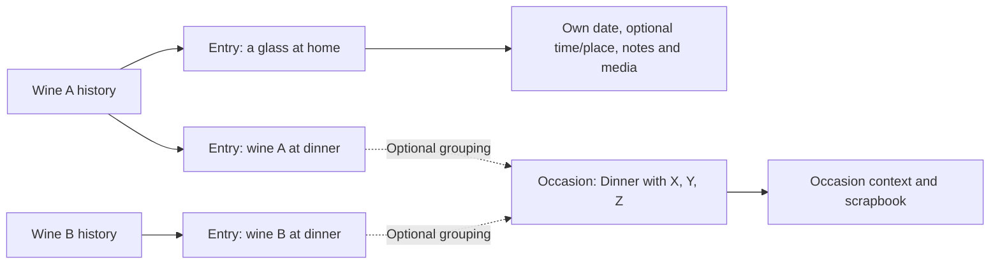

# Wine entries and optional occasion scrapbooks: product journeys

Status: working product/UX draft, not application development or finalized screen designs. Latest clarification: recording a glass, sample, or bottle does not require an occasion. An occasion optionally groups entries into a named memory with location/date/time. Shared participants and collaboration are later ideas. Story IDs refer to [story-map.md](story-map.md).

## The distinction: what, when/where, and optional occasion

| Concept | Responsibility | Example |
| --- | --- | --- |
| Wine record | Identifiable wine/release, available specs, current personal rating and its history | Calculated Risk Barrel Selection 2023 |
| Drinking entry | One encounter with that wine: consumed date, optional time/location, personal notes and photos/videos | A sample at a shop; a glass at home; a wine drunk during dinner |
| Occasion | Optional grouping and broader memory: editable title, date/time, location, general notes and an album | Dinner with X, Y, Z; Sunday lunch; a tasting visit |

The occasion does not need to be grand, but the user chooses whether to create it. A wine entry requires no occasion, including no automatically created hidden/unnamed occasion. This supersedes the earlier one-occasion-per-save proposal. Wine plus date remains the minimum save.

Recommended MVP relationship: each entry is standalone or linked to one occasion; an occasion can group several entries and wines. Multiple entries may involve the same wine. Quantity tracking remains optional scope to review.

## One journal, two ways to revisit it

| View | Main user question | Suggested content |
| --- | --- | --- |
| My Wines: primary | What have I tried, what do I think of it now, and when/where did I drink it? | All wine entries, including standalone encounters; current rating/history and optional links to occasions |
| Occasions: secondary | What was that dinner or visit like, and which wines were there? | Explicitly created occasions with title/date/time/location, general notes, linked wine entries, and a scrapbook |

Calendar is a possible later date-based view of all drinking entries, including those without an occasion. Occasion context can be shown where present. It must not omit everyday glasses or count an occasion and its entries as duplicate drinking activity.

The relationship is conceptual, not a database schema commitment:

Several bottles of the same wine at that dinner do not automatically mean several occasions. Quantity tracking is optional scope to review, not a required input. A wine's current personal rating and retained rating changes remain independent of this dinner.

## Journey A: Save one wine quickly

Stories: WI-01/WI-02/WC-01, TJ-01, AC-01.

1. Scan, photograph/upload, or search for a wine. Read its details without needing an account.
2. Choose to record that it was drunk. Wine plus date remains enough; title, place, rating, notes, and media are optional.
3. If signed out, sign in with the selected wine/date preserved.
4. Save and see the drinking entry in My Wines. No occasion is created unless the user chooses one.

Suggested UX: Log wine -> wine and consumed date -> Save. Time, location, notes, and Add to occasion are optional. Default the date to today with easy backdating. Unknown time stays unknown; do not imply midnight or the entry creation time is when it was drunk. Exact placement and copy will be refined in wireframes.

## Journey B: Add more wines to that occasion

Stories: TJ-05, TJ-06, TJ-03.

Example: one dinner, three different wines, including two bottles of one of those wines.

1. Create an occasion, or open an existing one. Allow a title such as Dinner with X, Y, Z, location, date, and optional time.
2. Choose Add wine while the occasion is still being created, or from its saved scrapbook. Identify it through barcode, photo, or search; manual creation can include a personal bottle-cover photo. Occasion date/location can be suggested defaults, with correction available; exact drinking time remains blank.
3. Return to the same occasion with title, context, notes, and earlier wines retained. In the proposed new-occasion flow, entries are staged and can be edited/removed before saving the occasion and its new entries together. Canceling a child flow preserves the parent. In a saved occasion, saving a new entry returns directly to that scrapbook.
4. Repeat as needed. The occasion shows its linked entries and each wine history points back to this same dinner. Repeating Save must not duplicate either record in the eventual application.

If the user begins from global lookup instead, offer both selecting an existing occasion and creating a new one inline. The inline form captures title and when/where; saving it together with the entry leads to the scrapbook, where more wines can be added. Canceling that inline form preserves the standalone entry. Within an occasion's child add-wine flow, keep its context visible and avoid offering recursive occasion creation. Never assume that lunch and dinner were the same occasion just because the date matches.

A failed lookup for wine B should not undo the already recorded wine A. Adding another wine or bottle does not require a rating change. Occasion title is supported; whether to require it when deliberately creating an occasion is still open. A title is never required to log a wine.

## Journey B2: Group existing entries later

Stories: TJ-08, TJ-09 (linking behavior is an MVP proposal).

1. Save two wine entries during dinner, without an occasion.
2. Later choose Add to occasion on an entry, or select entries from an occasion's Add existing entries action. Batch selection is a UX proposal to size separately.
3. Create Dinner with X, Y, Z or choose an existing occasion. Preserve the selected entries, notes, media, and personal wine ratings.
4. If an existing entry has a different date/location, show that distinction and preserve its recorded details unless the user deliberately edits them.
5. Unlinking an entry returns it to standalone browsing without removing its when/where, notes, or media. No duplicate tasting is created.

## When/where and occasion editing

Location now supports either a freely typed personal label or an official-place selection. The same control appears on entries and occasions. Place suggestions distinguish matching names with locality/address; a custom label such as Alex's house remains valid without geocoding. Changing a selected label clears its provider association. Google Places is the proposed source to assess later; the second walkthrough uses explicitly labeled sample places. See [UX review 02](ux-review-02.md).

Recommended rule: entries own their consumed date and optional time/location. An occasion owns its event date/time/location. Occasion details may supply defaults for new entries, but editing a dinner's start time does not silently change the recorded time of every wine drunk there. An occasion start time is context, not evidence of the exact drinking time for each wine.

For example, an occasion may start at 7 pm and one wine may be logged at 9 pm. Both values can coexist. Opening an occasion should show event context; the wine's history should show its encounter details. Any future bulk update of linked entries must identify the affected fields and entries. Multi-day/multi-location events and exact timezone controls remain separate scope decisions.

## Journey C: Return later to build the scrapbook

Stories: TJ-04, OM-01 through OM-04, HB-05.

1. Open a standalone entry from My Wines, or open an occasion from Occasions / a linked wine entry.
2. Add notes, photos, and supported videos to the standalone entry. For an occasion, also allow general memories and album content alongside its wine entries.
3. Revisit personal entry memories in wine history or the fuller grouped scrapbook when an occasion exists.

Recommended visual direction: a prominent chosen memory/cover, readable date/place context, photo arrangements with captions, video previews with explicit playback, and space for short written memories. These are proposals to test, not a commitment to every editing control. A record with no photos still has a useful text/wine presentation.

Recommended media organization: wine entries can own personal media, and an occasion can own a general album. The occasion can present linked-entry previews plus its general memories; use references rather than asking for duplicate uploads. Creating an occasion link does not move or republish an entry's media. Exact combined-gallery and wine-specific association controls remain UX proposals; automatic tagging and a free-form collage editor are not implied.

The user's two-view preference is confirmed; exact cover/caption/order controls and wine-specific media associations remain open. Prefer reviewing a small representative scrapbook layout before selecting editing features.

## Journey D: Revisit a wine, then the whole occasion

Stories: HB-01, HB-02, HB-05, TP-04.

1. Open My Wines, proposed default order most recently consumed first.
2. Open a wine to read its available specs, current personal score/history, then all drinking entries, ordered by consumed date.
3. Open a standalone entry to see its details/media, or follow an occasion link when present to see the dinner scrapbook and other wines.
4. Open another wine from that occasion to reach its record. Returning should preserve the browsing context; exact navigation belongs in wireframes.

The user has clarified that distinct wines, vintages, and releases must retain their identities, with intuitive sorting/filtering. [Wine identity research](wine-identity.md) recommends independent current ratings/history per identifiable release; exact card grouping is still a UX proposal. Rating changes have their own dates; they do not change the occasion date or imply another drinking encounter.

## Journey E: Write freely or use tasting guidance

The user wants free-form notes plus optional suggestions for beginners in the MVP. Open any wine entry, including one without an occasion, and optionally use Help me describe it for prompts and term explanations. Guidance applies to that entry, while dinner-wide notes/photos belong to an optional occasion. The current numeric rating and its revision history stay on the wine record. Details are in [tasting notes research](tasting-notes.md), story TJ-07.

## Acceptance examples for the occasion stories

### TJ-05: Several wines together

- Wine A and wine B can have entries linked to one occasion, with event context and independent encounter details/observations.
- Opening that occasion from either wine reaches the same notes and album.
- A separate occasion on the same date stays separate unless the user deliberately selects it.

### HB-05 and OM-04: Alternate view and scrapbook

- My Wines remains the main record-keeping entry point; Occasions is a directly accessible alternate view.
- An occasion can be read as a complete memory, with its wines, notes, and photo/video content together.
- Enriching a memory from either entry point updates what the other view shows; absent media does not make the entry invalid.

### TJ-01, TJ-03, TJ-08, and proposed TJ-09: Optional grouping

- A sample glass can be saved with wine/date and no occasion; time/location/notes/photos/videos can be added to that entry later.
- Users can title an occasion and record its location/date/time; one or several wines can be associated with it.
- Two entries with the same date or location stay independent unless the user groups them.
- Linking an existing entry adds no duplicate wine encounter and changes no rating history; unlinking retains that entry's details and media.
- Changing occasion context leaves recorded entry when/where intact unless the user explicitly changes those entries.
- My Wines and a later calendar include standalone entries; Occasions does not manufacture events for them.

## Later direction: People and shared memories

The user's suggestion introduces focused occasion collaboration beyond the private MVP. Proposed interface labels: People, Invite people, and Shared album or Memories. Participants describes people who accept an invitation; Host or Organizer can describe the occasion owner. These are naming recommendations, not fixed branding.

Writing Dinner with X, Y, Z in a title, or later remembering people with private text labels, does not imply an invitation or grant access. Remembering who was present and letting someone contribute are different capabilities. Non-account attendee labels are a possible later refinement; no contact import is implied.

| Later story | Proposed outcome | Boundary to preserve |
| --- | --- | --- |
| SC-01: Invite participants | People can accept an invitation to a selected occasion | Access is scoped to shared occasion content; personal journals stay private |
| SC-02: Shared memories | Participants contribute photos/videos to a common album | Explicitly chosen contributions retain attribution; entry media is not exposed automatically |
| SC-03: Shared notes | Participants add recollections or edit an agreed shared note | Personal observations remain individually owned; coediting and conflict behavior still need design |
| SC-04: Participation controls | Users understand roles, leaving/removal, and content retention | Membership does not assert that a person drank every wine; adding entries to their journal is deliberate |
| SC-05: Coauthored review | Participants may author a joint opinion | Private group notes and public publication are separate; authorship and rating semantics need definition |

Recommended content separation: personal entry notes/ratings; deliberately shared occasion notes/media; explicitly published public reviews. Shared occasions may remain private to participants and do not require a public feed. A host must not be able to rewrite someone else's personal rating. Public joint-review scoring should not be designed until the desired authorship model is clear.

Before collaboration is built, define invitation acceptance/revocation, roles, contributor attribution, edit conflicts, leaving an occasion, and deletion/retention of contributed media. This is later feature work; the current phase only preserves clear ownership and boundaries in the product model.

## Behavior still to define

- Validate release-preserving library layouts, grouping, sort/filter choices, and the proposed per-release rating presentation.
- Choose the smallest useful guidance controls; allow free-form writing and optional prompts without requiring a complete tasting assessment.
- Exact album previews on wine pages and whether media can be associated with individual wines.
- Cover selection, captions, ordering, and how much layout control users actually need.
- Removing a wine entry versus unlinking it, deleting an occasion, and what happens if its last entry is removed. Recommended default: occasion deletion preserves drinking entries and entry-owned media; separately handle occasion-owned notes/album with a clear user choice.
- Exact title requirements and event date/time fields; how defaults and intentional bulk edits are presented without silently rewriting entry details.
- Multi-day occasions and mandatory bottle counts are not established requirements.

Next artifact: low-fidelity screens for My Wines, a wine record, Occasions, an occasion scrapbook, and optional note guidance. Use these to test the remaining grouping and prompt choices rather than requiring every layout decision in advance. No code or scaffolding is part of this phase.
