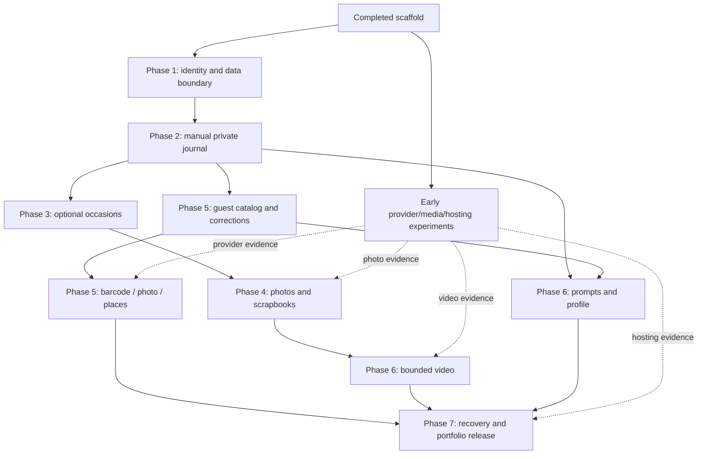

# Wine Journal phased implementation plan

Status: proposed execution plan for review, September 14, 2026. The repository scaffold is complete; product features remain unimplemented. This planning change creates no application code, migrations, services or deployments.

Use this document for sequence and scope, [todo.md](todo.md) for executable task checkboxes, and [story-coverage.md](story-coverage.md) for traceability across all 65 stories. The plan has **59 remaining bounded tasks**, seven implementation phases after the completed foundation, and a separate early feasibility lane. Later product branches are deliberately less detailed until their requirements are selected.

## Starting point

- **Implemented:** Next.js startup screen, FastAPI liveness endpoint, domain/workflow folders, lockfiles, generated contract/types, initial tests and CI. [ADR 0005](../docs/decisions/0005-repository-foundation.md) records the accepted organization.
- **Not implemented:** real sign-in, application database schema, private journal, providers, uploads, workers or deployment. Docker/local Supabase startup still needs verification.
- **Architecture:** domain-oriented modular Python core, thin Next routes around workflow features, shared Postgres transactions for journal changes, and durable supporting work when needed. A folder is not a microservice; neither iOS nor background processing requires a service-per-feature design.
- **Budget and capture:** local/free-first; online saves are the baseline. Failed online forms preserve recoverable input; automatic offline synchronization is a later product decision.
- **Design:** implement the reviewed Stitch direction and [UX review 04](ux-review-04.md). Browse Wines is first in navigation; My Wines is the first private-journal destination.

## Phased roadmap

| Phase | Working outcome | Task IDs | Exit evidence |
| --- | --- | --- | --- |
| 0 — Foundation | Runnable, versioned scaffold | BASE — complete | Existing local builds/tests and initial GitHub CI |
| Early feasibility lane | Measured provider, media and hosting decisions | R01–R07 | Reproducible reports; each gates only its dependent work |
| 1 — Access | Real sign-in, account ownership and local data/test environment | F01–F07 | Two-account auth journey; migration/privilege and token tests |
| 2 — Private wine journal | Manual wine/date capture, repeats, later edits, ratings/history, search/sort | J01–J10 | Save → reload → repeat → edit → rate → find, without any occasion |
| 3 — Occasions | Optional multi-wine groups and both creation directions | O01–O05 | Three wines/four entries, nested rollback, safe link/unlink/delete |
| 4 — Photo scrapbook | Private photos, manual bottle covers, occasion albums and wine highlights | M01–M08 | Exact gallery eligibility plus interrupted-upload/worker/deletion recovery |
| 5 — Assisted lookup | Guest specs/search, barcode and photo recognition, corrections and official places | C01–C08 | Physical-phone capture and measured match/fallback/privacy cases |
| 6 — Complete media and learning | Bounded iPhone video, optional prompts, Guides and private taste summaries | V01–V02, L01–L03 | Real playback, accessible guidance and fixture-backed profile counts |
| 7 — Portfolio release | Export/deletion, restore, deployment, operations and final UX/performance checks | E01–E09 | Reproducible release demonstration and recovery/privacy evidence |

**Milestones:** Phase 2 is the first useful personal journal. Phase 4 adds the core scrapbook experience. Phases 5 and 6 together complete the planned feature set. Phase 7 establishes a portfolio release that can responsibly retain user memories. An earlier milestone is not silently relabeled the full MVP.

The table is the recommended walkthrough order, not an all-or-nothing serial dependency chain. C01/C02 may start after J01/J04 and the necessary fixtures; L01 may start after note editing; R work can proceed alongside authentication. Exact task dependencies in todo.md are authoritative. Do not make manual capture wait for universal catalog coverage.

## Dependency map

This is a dependency summary, not a deployment diagram. The web, API and worker still follow the accepted architecture.

## Delivery discipline

Build one behavior through the layers it needs. Shared foundations such as token verification, migrations and the job runner are explicit enabling tasks; do not build the entire planned schema or every API before a user can save and retrieve a wine. Add feature libraries, models and abstractions when their task uses them.

Each task has an outcome, at most two acceptance bullets, specific verification, dependencies, relative size and primary change areas. S is a narrow change or decision; M is one bounded behavior/enabler, generally one or two focused work blocks. At task start, confirm concrete files and tests; split work that exceeds about five handwritten source files or two blocks instead of disguising a large implementation as one checkbox. These are planning estimates, not promises of hours.

Checkpoints occur after approximately three tasks and at phase exits. They are opportunities to demonstrate working behavior and collect feedback, not automatic new permission requests after every edit. Actual product decisions, scope changes and paid-service choices remain explicit. Stop a dependent feature when its required decision or feasibility result is missing, while continuing independent work.

Record completion only with evidence. A mock is appropriate for deterministic provider failure tests; it does not prove live barcode/photo recognition. A failed feasibility experiment can complete its evidence task while leaving the dependent integration blocked. Never substitute a placeholder route or passing empty test for implemented behavior.

## Decision gates

| Gate | Resolve before | Current position / required decision |
| --- | --- | --- |
| G1 — Authentication | F03/F05 | F01 selects one real sign-in/recovery method, allowed callback/return paths and delivery setup. Guest lookup stays available. |
| G2 — Journal controls | J01/J08/J10/O01 | Confirm minimum manual identity, rating scale/clear/history-erasure behavior, small initial sort/filter set and occasion title/date defaults. Wine/date-only save, separate release identity and wine-level rating history are already fixed. |
| G3 — Media limits | M02/V01 | R04/R05 establish decoder/transcoder feasibility; choose byte/pixel/duration/account limits, original-versus-derivative retention and clear recovery behavior against R07 resource limits. iPhone support and bounded private video remain in scope. |
| G4 — Lookup coverage and market | C01/C04/C06/C08 | R01–R03/R06 define the first catalog/market, supported samples, provider coverage/limits, candidate ambiguity and source handling. Record a curated real-data fallback where viable; no invented coverage or live availability. |
| G5 — Learning/profile breadth | L01–L03 | Select a small guide set, optional prompts and transparent aggregation rules; TP-02 explicit likes/dislikes is optional OPT-01 until selected. |
| G6 — Operating promise | E03–E09 | R07 selects a viable runtime arrangement and budget. Agree backup retention/recovery targets, expected demo availability and workload before measuring or claiming them. Weekly capacity remains unknown, so no calendar deadline is invented. |

Existing acceptance examples guide these decisions; they are not all finalized controls. A new decision that changes an accepted architectural boundary gets an ADR; ordinary UI wording and threshold choices go into the relevant story/task.

## Scope that each phase must preserve

1. Lookup and drinking are different actions. Guests can inspect details; saving requires an account.
2. A consumed calendar date is distinct from record creation time. Optional time/place never require an occasion.
3. Named offerings and their vintages/releases remain distinct. A barcode, label or name is not a primary key or guaranteed vintage match.
4. A wine has one current personal rating and dated revisions; another glass is another entry, not another rating vote.
5. Occasion-first and wine-first capture share draft behavior and atomic journal saves. Existing-entry context is preserved when linked.
6. Covers, recognition uploads, entry attachments and general occasion attachments have distinct purposes. Gallery queries deduplicate eligible references rather than copying memories.
7. Private journal data remains private. Public reviews and invited participants require deliberate future publication/access models.
8. Both recognition routes, optional beginner guidance, photos and bounded private video remain part of the planned product; failures or cost constraints require a recorded decision, not a silent omission.

The baseline includes useful supporting proposals such as recovery, safe media retry, export/deletion, basic Browse, a small Guides collection and link/unlink management. Their exact UX breadth is reviewed at the gates. Full provisional-record merges, live retailer comparison and explicit extra preference controls are not smuggled into the baseline.

## Verification protocol

The task-specific Verify paragraph defines what must be proven. Apply the relevant checks below rather than running every expensive check for every copy edit.

| Change | Required evidence |
| --- | --- |
| API/domain behavior | Focused pytest cases plus Ruff and Python types. Transactions, constraints, ownership, idempotency and races use real disposable Postgres, not SQLite substitutes. |
| Database migration | Fresh migration and representative upgrade; verify runtime grants/constraints and document rollback compatibility. Run migrations once per deployment, not on API startup. |
| Web behavior | Type/lint checks and focused interaction tests for behavior; use Playwright for critical connected journeys after F07. Keyboard, mobile and empty/error states are part of the task. |
| Contract change | Regenerate OpenAPI and TypeScript types, inspect the diff and update the consumer in the same slice. CI detects drift. Resolve the draft GET/bootstrap semantics in F04 before implementing them. |
| Upload or worker change | Local Storage/Postgres integration, malformed/oversized input, two-account signing/attachment tests, restart/retry/late-upload cases and reference-aware cleanup. No exactly-once processing claim. |
| iPhone/camera/media behavior | Real-device samples and Safari checks with device/OS/codec details. Browser simulation supplements physical checks; it does not replace them. |
| Provider integration | Deterministic contract/failure tests plus a small real evaluation sample. Record provenance, unknown fields, latency and usage limits without committing secrets or private uploads. |
| Editorial/docs-only change | Source/link/consistency review. Do not invent unit tests for static wording or repeatedly rebuild unchanged app code. |
| Release/operations | Actual export/deletion/restore/restart/rollback drills and measured workload results. Screenshots and health responses alone do not establish readiness. |

Current commands are documented in [development.md](../docs/development.md). From apps/api, run `uv run --locked pytest`, Ruff and mypy with the documented paths; narrow pytest to the affected tests once they exist. From apps/web, use `npm run lint`, `npm run typecheck`, `npm run format:check` and the build as appropriate. F07 introduces and documents the actual browser-test commands; do not pretend an unimplemented test script already exists. At phase exits, run relevant complete suites, contract drift checks and affected builds; repeat only after relevant changes or new concerns.

**Definition of done for a task:** acceptance is satisfied, relevant tests/checks pass, the previous working flow still works, private data boundaries hold, contracts/docs are updated, and evidence/remaining limits are recorded. New critical paths include safe diagnostic context when introduced; E05 verifies operation across the assembled system rather than adding all observability at the end.

## Cross-cutting regression fixtures

Keep reusable fixtures small and explicit:

- Two accounts; a guessed private ID or nested asset/entry from the other account.
- Two vintages with similar labels; unknown versus verified non-vintage; one barcode resolving to multiple candidates.
- One standalone glass; two intentional same-day entries; an old consumed date recorded today.
- Current rating 4 → 4.5 without a new drink, if that scale is approved; stale and duplicate submissions.
- An occasion with three releases and four entries, including a repeated wine.
- The same occasion linked twice from one wine; one general photo; a different wine's entry-only photo; a cover; a repeated asset reference.
- A lost save response, stale edit, failed upload, late upload after removal, and worker termination mid-processing.
- Export/deletion/restore with real attachment relationships and an already-issued access capability.

These cases are built with their owning slices and reused at phase gates. Avoid giant end-to-end tests that try to assert every domain rule at once.

## Risks and responses

| Risk | Response / owner |
| --- | --- |
| Free wine data cannot reliably resolve vintages | R01–R03 measure this early; C04/C06 preserve ambiguity and text/manual correction. A curated catalog may constrain real supported coverage, but cannot impersonate a universal live source. |
| Free runtime cannot process chosen iPhone uploads | R04/R05/R07 measure before media integration; choose bounded inputs and a viable worker arrangement. Do not defer compatibility silently. |
| Lost saves or inconsistent nested occasions | J02/O02/O03 use transactions and request-key tests; UI drafts survive recoverable failures. |
| Accidental exposure across views or future sharing | Same-owner constraints plus API checks now; exact gallery fixtures in M06/M07; X2/X3 require explicit new public/membership models. |
| Scope grows into a social network before the journal works | Private milestones remain separate; X1–X7 need activation and detailed planning. |
| A polished prototype hides missing real integration | Phase exits demand actual persistence/device/provider evidence and label simulated demo paths. |
| Free-service pauses, quotas or missing backups weaken the demo | R07/E03/E05/E09 define the actual operating promise; use disposable data until recovery is proven for relied-upon memories. |
| Broad tasks or uncertain availability create false schedules | Re-slice oversized tasks, track actual effort through Phase 1 and the first complete J flow, then forecast from measured pace and weekly capacity. |

Commercial licensing procurement remains deferred per the user's direction. Basic source attribution, practical access and quota checks still accompany an integration; the plan does not require paid services to begin.

## First work package

Start **F01, F02, R01 and R04** as independent decision/setup/evidence work; this is an ordering option, not a request to spawn agents. Continue F03/F04 once the sign-in choice and database fixture are ready, then F05–F07. R02/R03 use the common bottle set; R05/R07 investigate video and runtime viability while the manual journal progresses.

The first user-visible implementation target is **J04: save wine/date and reopen it after reload**. J05–J10 then make that flow useful for repeat drinking and changing opinions. Do not start a public feed or generalized recommendation/service infrastructure while this basic journey is incomplete.

## Later branches

The ordered outlines and readiness checks are in [todo.md](todo.md#later-phases-separate-activation-decisions):

- X1: calendar, want-to-try organization and deeper structured tasting.
- X2: deliberate public wine reviews/profiles, recent feed and moderation.
- X3: selected shared occasion notes/albums and participant permissions.
- X4: explainable similarity, evidence-based trends and profile-linked guides.
- X5: native iOS against the same backend contracts.
- X6: unidentified durable drafts and true offline synchronization.
- X7: separately scoped social interactions, public media and current merchant offers.

They are not equally urgent or implementation-ready. Private collaboration and native iOS can precede a public feed; public trends cannot precede meaningful public activity. Extract a supporting service only for a measured workload, isolation or ownership need.

## Retained product brief and research

The sections below preserve the existing product reasoning. The roadmap and task IDs above are the execution source; [story-map.md](story-map.md) remains the scope source, and [architecture.md](../docs/architecture.md) remains the system-design source.

## Product problem

How might we help someone remember which wine they drank, what they thought of it, and the occasion around it, then find that bottle again?

The intended audience includes casual drinkers, enthusiasts/connoisseurs, and eventually people participating socially. The first concrete user is the creator: a casual drinker learning about wine, tracking experiences, and building a personal taste profile. Success means capturing and retrieving meaningful experiences with little effort while allowing more detailed notes as knowledge grows. The portfolio demonstration is: identify a bottle, confirm it, save a tasting with a photo, record a second encounter, revisit both experiences, and inspect a simple summary of preferences.

Confirmed in the conversation: private journal first; public ratings, reviews, and a feed later; web first and iOS eventually; preference for a Python backend with a polished frontend and established technologies. Next.js and FastAPI are now recorded in ADR 0005 and the completed scaffold. Weekly time, monthly budget, initial country/retail market, private-media limits, and detailed rating/profile controls remain open.

Further clarification: identification has two first-class paths: scan a barcode to bring up wine details automatically, or photograph/upload a bottle for image recognition/reverse lookup, with text search also available. The primary journal view is by wine, with all dated occasions and their places, personal notes, photos, and videos beneath it. Occasions is the secondary view; calendar remains a possible later navigator. PostgreSQL is recommended on technical fit; the current architecture proposes Supabase as its host plus Auth and Storage, subject to review and operating budget. Private video belongs in the journal scope; clip limits and processing strategy remain to be sized.

Latest provider preference: the user would like to learn Supabase and is interested if a suitable free tier is available, with free/local alternatives otherwise. The current architecture evaluates Supabase free-tier constraints and local development; final host selection, purchase and deployment remain unrequested.

Latest product decisions: recording only the wine and consumed date is sufficient; quick notes, place, photos/videos, and rating input are optional and can be supplied later. This is a valid saved entry, not an obligatory incomplete draft. Another primary intent is simply looking up specs (including available price context) with friends without saving any experience. Barcode/photo/text lookup is available without sign-in; saving requires an account. Public lookup is in the MVP, while public user reviews/profiles/feed remain later. One current personal rating belongs to the wine itself; updates retain past scores/change dates and are independent of drinking occasions. The wine's displayed personal score is the current user choice, not an average of past ratings.

Latest occasion/view decisions: a drinking entry can stand alone with its own consumed date and optional time/location, notes, photos, and videos. It requires no occasion, including no automatically created unnamed occasion. Users may optionally group one or several entries into an occasion with title, date/time, location, general memories, and a scrapbook. My Wines shows all wine records and their entries; Occasions is the secondary browse of explicitly created groups. A later calendar must include standalone entries too. Detailed journeys are in [occasion-journeys.md](occasion-journeys.md).

Latest future idea: explore invited participants, shared occasion notes/reviews, and a common photo/video memory space later. Proposed UI naming is People / Invite people, with Participants for accepted members. This focused collaboration has its own stories SC-01 through SC-05 and need not depend on a public feed. Personal wine ratings and private observations remain separately owned; shared contributions and public publication are deliberate actions. No collaboration implementation is part of the private MVP.

Latest identity/notes decisions: distinct offerings, vintages, and releases retain their identities; My Wines should offer intuitive sorting/filtering. The working recommendation is one current personal score/history per identifiable release, independent of how related records are grouped visually. [Wine identity research](wine-identity.md) uses Calculated Risk and other primary examples to inform this distinction. Free-form notes plus optional beginner guidance are now MVP direction; [tasting notes research](tasting-notes.md) proposes original prompts and boundaries. Exact layouts, prompt controls, rating scale, and correction conflicts remain to be reviewed. These product decisions guide the phased implementation above; this planning update does not begin feature implementation.

## Directions worth exploring

| Direction | Reason to use it | Main assumption and cost |
| --- | --- | --- |
| Wine scrapbook | Remember the bottle and the people, meal, or trip around it | People will return to their memories; capture must be very quick |
| Minimal bottle memory | Photo, rating, and "would buy again" in a few taps | A short record solves most of the problem; less expressive |
| Guided tasting notebook | Learn to describe flavor and observe changing preferences | Users want structured input; longer forms may discourage logging |
| Wine discovery community | Find recommendations through other people's reviews | Needs contributors, useful content, moderation, and trust |
| Tasting club | Record and compare several people's experiences at an event | Group coordination is a distinct audience and workflow |
| Personal buying companion | Recall favorites and find similar bottles in a budget | Reliable offers and regional availability become major dependencies |

Direction following the user's clarification: the scrapbook, with the minimal bottle-memory flow as its quick-add mode and a simple evolving taste profile. Optional tasting detail should serve enthusiasts without making casual users complete expert forms. Define public wine reviews and feeds now as an expansion contract, then implement them after the private journal proves useful. Groups and buying assistance remain further expansions.

## Scope proposal

| Capability | First usable journal | Portfolio MVP | Expansion |
| --- | --- | --- | --- |
| Account and private journal | Included | Included | Additional sign-in methods |
| Manual wine entry and search | Manual capture and private history search | Guest catalog search and safe private identity correction | Advanced merge/correction tooling |
| Standalone drinking entries and optional occasions | Wine plus date without an event | Repeat entries with optional time/location; titled groups of one or several wine entries | Invited participants and shared contributions |
| Personal wine rating with change history | Later slice after basic journal | Current chosen score and dated past scores | Richer preference analysis |
| Personal notes and tasting guidance | Free-form notes | Optional beginner prompts and terminology help alongside free text | Detailed structured tasting assessment and comparison |
| Photos/videos and a scrapbook reading experience | Added after the first manual journal milestone | Entry media without an occasion; optional occasion album/scrapbook | Shared albums and advanced layout editing, if useful |
| Wine-first library/history | Included | Primary view, sorted by latest consumed date | More filters and presentation options |
| Occasion browsing | Optional title/date/time/location | Secondary core view for deliberately grouped dinners/visits | Shared participation and further presentation options |
| Calendar view | Deferred | Later than both core views | Month/day navigation across all drinking entries, with occasion context where present |
| Barcode identification | Later slice | Included: clear match opens details; ambiguity prompts selection/correction | More providers and code formats |
| Label photo identification | Later slice | Included as a directly accessible path, assisted and correctable | Better matching after measurement |
| Wine details and outbound purchase links | Manual or sourced fields | Best available sourced fields and links | Regional live offers and price comparison |
| Taste profile | Basic counts after history exists | Current-rating and known-attribute summaries with sample counts; extra explicit preferences remain OPT-01 | Explainable similarities and richer taste analysis |
| Public wine reviews | Deferred | Deferred, per user decision | Explicit publication of text/rating and public pages per wine; comments and broader forum later |
| Public photo/video publication | Deferred | Deferred by recommendation | Explicit publication with moderation |
| Personal video attachments | Later slice after photos | Bounded private clips on entries or occasions; formats, limits, and processing to scope | Shared contributions, richer editing, and longer clips |
| Trending and similar wines | Deferred | Deferred; private profile only | Public activity ranking and explainable similarity |
| iOS | Mobile browser | Responsive web | Swift or React Native client selected in X5 |

The earlier suggestion to defer all video was not an agreed requirement. Following the clarification, private video is part of the planned journal; implement it in a bounded slice with upload/playback acceptance criteria and an explicit processing decision. Public media/community remains later. Wine history and occasion media should receive enough attention that the MVP feels like a journal rather than a catalog form.

No first-release checkout, wine inventory management, trained recognition model, general web crawling, chat, microservices, or collaborative recommendation engine is proposed. Each adds a separate delivery or operating burden.

## Core user stories and acceptance examples

The initial examples below are retained for context. [story-map.md](story-map.md) supersedes their IDs and scope labels with the current working inventory; open decisions there take precedence over these earlier illustrative rules. These are not a separate requirements contract.

| ID | User story | Acceptance example |
| --- | --- | --- |
| US1a | As a drinker with a barcode, I can scan and see the wine details automatically | A clear lookup opens the details immediately with a correction action; ambiguous identity or missing vintage asks only for the unresolved information |
| US1b | As a drinker without a barcode, I can identify the wine from a photo or search | Photograph/upload the bottle directly, or search by name/producer; recognition proposes matches and manual correction stays available |
| US2 | As a drinker, I can save a wine even when recognition fails | Permission denied, no match, provider timeout, or unavailable service all leave search/manual entry usable |
| US3 | As a journal owner, I can record a wine encounter | Save wine and consumed date without an occasion; optionally add time/location, notes/media, or deliberately link an occasion |
| US4 | As a returning drinker, I can add another encounter with the same wine | Two drinking entries retain independent dates, notes, and attachments, with or without occasions. The personal numeric rating belongs to the wine and has its own history. |
| US5 | As a returning user, I can browse my wines and their memories | Preserve distinct releases and offer sorting/filtering; proposed default order is most recently consumed. Opening a record shows that release's encounters, notes/media, and independent current rating/history. Related-vintage grouping is a UX option to test. |
| US6 | As a curious drinker, I can understand the bottle | See available producer, country/region, grapes, style, vintage, ABV, and sourced tasting description; missing fields remain unknown |
| US7 (later) | As a reviewer, I can publish an opinion while keeping my journal private | Preview public text/rating, publish it, edit or unpublish it; private notes, dates, location, and attachments are excluded |
| US8 (later) | As a reader, I can browse useful public reviews | A wine page shows published reviews and rating counts; repeated private tastings do not inflate its score |
| US9 | As a buyer, I can follow an available wine link | A known producer/retailer link is identified as such; a search link is labeled "Search retailers" and never implies confirmed stock |
| US10 | As a journal owner, I can trust access boundaries | A second account cannot read or change my entries or private media through API requests, exposed data endpoints, or guessed object paths |
| US11 | As someone learning about wine, I can see my preferences develop | Show favorites and ratings grouped by known grape/region with counts; missing metadata and small samples do not become confident taste claims |
| US12 | As a beginner or enthusiast, I can record observations with as much help as I want | Free-form notes and optional guidance apply to any wine entry, even without an occasion. Basic guidance is MVP direction; detailed scales remain later. |
| US13 (later) | As a journal owner, I can revisit what I drank on a date | A calendar includes all drinking entries and labels occasion context where present, using the same records reached from My Wines |

Proposed rating convention: optional 1–5 stars in half-star steps, plus an optional "would buy again" choice. Confirm this with the intended audience before fixing validation rules.

## Identification and data feasibility

There are three separate problems: decode the barcode/read the label, resolve the correct wine and vintage, and obtain licensed descriptive/retailer data. Success in one does not guarantee the others.

Two first-class user paths converge on the same wine-details screen:

1. **Barcode available:** Scan -> decode UPC/EAN -> query known identifiers/provider -> automatically display details for a clear match. Keep "Wrong wine?"/edit available. Do not force a candidate picker when there is no ambiguity. If several wines are plausible or vintage is unresolved, ask only for that missing distinction.
2. **No barcode, or user prefers a photo:** Take/upload a bottle image -> identify it using a label-recognition service and/or OCR plus catalog matching -> show the result or a short candidate list when uncertain. Text lookup by wine, producer, or label wording is available directly, without attempting a scan first.

Both paths first reuse suitable existing records, then obtain external data when needed, and always allow search/manual continuation. Displaying a match does not automatically create a tasting; the user explicitly saves a drinking entry and may optionally link an occasion. Manual entry is a valuable early implementation slice, while both automated paths remain part of the intended MVP.

Recognition, OCR, and reverse image search are different mechanisms for the photo experience. Recognition proposes a wine identity, OCR reads visible text for catalog search, and web image matching can return related images/pages. A reverse-search page is evidence to resolve a wine, not by itself a structured or reliable vintage record. Benchmark a specialist recognizer and OCR/catalog matching first; add web image matching only if it closes a measured gap. Google Cloud Vision documents web-entity and matching-page/image results as a possible technical option. [Web detection](https://docs.cloud.google.com/vision/docs/detecting-web)

Preserve conflicting/missing evidence and never invent a vintage. A confidence value is a provider score, not automatically a calibrated probability; choose result-display/confirmation thresholds from the evaluation. An unknown wine may remain an owner-only provisional record until catalog confirmation.

A barcode must not be the application's primary wine ID. GS1's wine examples show both changing a GTIN by vintage and retaining a GTIN while identifying vintage through a consumer product variant. Confirm the year independently when the lookup does not resolve it. [GS1 wine examples](https://dl.gs1sk.org/standard/wineProducts)

QR codes can contain a producer URL or another kind of identifier. Treat them as structured input when supported, or offer a labeled external link; do not fetch arbitrary scanned URLs on the backend.

| Candidate | Evidence checked | What remains unvalidated |
| --- | --- | --- |
| Barcode Lookup | Documents UPC/EAN lookup and product/store fields; starter advertised at $99/month for 5,000 calls | Coverage of the target wine set, vintage precision, caching/display rights, fit to budget. [API](https://www.barcodelookup.com/api) |
| WineAPI | Public documentation exposes wine search/details; homepage advertises image recognition and lists it in a $100/month Pro tier | Actual image endpoint access, coverage, provenance, caching/public display terms, and suitability of the personal-use free tier. Public docs inspected are narrower than the homepage claims. [Docs](https://wineapi.io/docs/) and [plans](https://wineapi.io/) |
| api4ai wine recognition | Offers label candidates and confidence, with vintage when available | Recognition quality on our bottles, cost, catalog enrichment, and data usage rights. [Product](https://api4.ai/apis/wine-rec) |
| Google Cloud Vision OCR | Extracts text and bounding boxes from images | Label-reading quality and whether the catalog can resolve extracted text; OCR itself supplies no wine catalog. [OCR documentation](https://docs.cloud.google.com/vision/docs/ocr) |

These are a shortlist for a feasibility test, not selected dependencies. No provider API calls have been benchmarked. Do not assume an accessible, affordable Vivino or Wine-Searcher integration; no such integration was established here. Avoid basing the MVP on scraping their sites.

Create a representative sample of roughly 30 bottles, with known identity and vintage: common and obscure producers, several regions, non-vintage wines, similar labels across years, and imperfect lighting. Record barcode decode rate separately from catalog match rate, correct candidate in top three, exact vintage accuracy, field completeness, latency, correction effort, and cost per confirmed save. Report sample counts; a small test is not evidence of universal coverage.

For the portfolio, prioritize free accessible sources and a small curated demonstration catalog. Check endpoint access, basic source requirements and quotas while integrating; broad commercial licensing research and paid procurement are deferred to a wider distribution/commercial phase. Clearly label limited or simulated lookup coverage. This work does not block the independent journal.

## Suggested technology baseline

The accepted direction is Next.js/React/TypeScript with App Router and TanStack Query for private client data, FastAPI/Pydantic, SQLAlchemy/Alembic, and Supabase Postgres/Auth/private Storage. Next owns web rendering and routing; Python owns journal rules and authorization. [ADR 0004](../docs/decisions/0004-nextjs-and-portfolio-budget.md) records why the small immediate Vite savings do not justify a planned migration for this project.

The complete rationale, dependencies, folder structure, local/deployment plan, connection strategy, and operating constraints now live in [architecture.md](../docs/architecture.md). This is the current technical source, replacing the early alternatives in this section. Sign-in method, rating scale, free provider access/coverage and concrete media limits still require validation before their implementation slices. The budget direction is local/free-first, commercial licensing analysis is deferred, and common iPhone media compatibility is required.

## Database justification and project independence

PostgreSQL is the database engine. Supabase is a platform offering hosted PostgreSQL plus services such as authentication and storage. Choosing the former does not require choosing the latter. Supabase documents that its projects use full Postgres databases. [Supabase database overview](https://supabase.com/docs/guides/database/overview)

PostgreSQL is recommended because the core relationships and queries already justify a relational database: a wine has releases and can recur across drinking entries, which may optionally belong to occasions containing several wines and broader memories. Wine-first history, latest consumed date per wine, occasion browsing, calendar ranges, and preference summaries can use these same records. Foreign keys, uniqueness/check constraints, and transactions help preserve consistency. [PostgreSQL overview](https://www.postgresql.org/about/), [constraints](https://www.postgresql.org/docs/current/ddl-constraints.html)

A database transaction can create a provisional wine/release and its tasting together so a failure does not leave half a database operation saved. Object-storage uploads are outside that transaction and need staged attachment states, retries, and cleanup. [Transactions](https://www.postgresql.org/docs/current/tutorial-transactions.html)

Use ordinary relational columns for identity, ownership, dates, ratings, and relationships. PostgreSQL JSONB can accommodate selected variable provider metadata where permitted, without making the whole journal an unstructured document. There is no initial need for a second database or a dedicated analytics service.

Alternative assessment: SQLite is reasonable for a deliberately local/single-user application; MySQL is a credible relational alternative for this web app. A document database can implement these features too, but offers no clear simplification for this relationship-heavy design. PostgreSQL is a project-fit recommendation, not a claim that other databases are unprofessional.

For an independent project, develop against standard PostgreSQL locally (a local installation or a container), maintain schema changes in Alembic, and keep application data access in FastAPI/SQLAlchemy. Hosting can be selected later by price, backup/restore, availability, and operating effort. Managed hosting is compatible with an independent application; self-hosting is a separate operations decision, not an automatic best-practice requirement.

If Supabase is selected, treat its database, auth, and storage choices separately. Keep an application user ID mapped to the provider identity and store media object references rather than permanent signed URLs. Migration of a plain database is different from migrating login identities, storage objects, policies, and service integrations; changing providers is feasible but not zero-work. Local migrations and focused auth/storage integration modules preserve practical portability without building a generic multi-provider framework. Supabase's database restore guide explicitly excludes moving storage objects and redeploying functions. [Restore scope](https://supabase.com/docs/guides/self-hosting/restore-from-platform)

## Primary wine view, secondary occasions, and later calendar

The primary screen is **My Wines**. Preserve distinct named offerings and identifiable vintages/releases. Recommended first wireframe: distinct release items with a way to browse related vintages; test grouped presentation as an alternative. The latest prototype preserves release cards and supports sorting/filtering; refinements remain possible. Grouping is presentation and must not merge identities or scores. A physical bottle inventory is not required.

Each release item can show a recognizable label/cover photo, producer/wine name, distinguishing origin/designation, vintage or edition, encounter count, current personal rating, and most recent date consumed. The rating is the user's latest chosen score for that release, not an average of historical scores. Do not invent a combined current score for grouped vintages. Proposed default order is most recently consumed first, based on the owner's maximum consumed date for each item. Adding an old memory today must not make it the newest wine unless its consumed date warrants that position. Sorting/filtering options are requested; exact choices are proposed in wine-identity.md.

Opening a card shows wine details, the current personal rating/history, and **Your experiences**, newest consumed date first. Every drinking entry has its own when/where, observations, and optional media, whether or not it belongs to an occasion. When linked, it can also open the broader occasion scrapbook with other wines. "Log again" creates an encounter; "Add to occasion" groups an existing encounter. Place can begin as optional text; time remains optional and unknown is not represented as midnight. GPS/maps are not required.

The secondary **Occasions** view offers a photo-led browse of explicitly created groups, with editable titles such as Dinner with X, Y, Z, date/time/location, and linked wine entries. Recommended media organization: entry-owned photos/videos plus a general occasion album, presented through references without re-uploading. An everyday glass needs no occasion to have media. The current combined album and wine highlights are documented in UX review 04; exact media-editing controls remain subject to implementation review. Later, a calendar can navigate all entries by consumed date, including standalone ones.

Example using fictional content:

- Hill Lane Pinot Noir — last enjoyed September 12; 3 experiences.
- September 12, 2026 — Bistro dinner — 2022 vintage — personal notes, three photos, one clip.
- June 8, 2026 — At home — 2022 vintage — different notes and two photos.
- April 5, 2026 — Weekend trip — 2022 vintage — its own notes and media.
- Separate personal rating history for this release: current 4.5; previously 4.0 and 3.5 with their change dates. Values illustrate changes, not an agreed scale; rating changes need not coincide with these drinking dates. A 2021 release would retain its own history and score even when grouped nearby.

A calendar is a later optional way to navigate all drinking entries, with or without occasions. A day may contain standalone entries and several distinct occasions. Distinguish entry, wine/release, and occasion counts without double-counting a linked entry. Do not duplicate records/media or automatically group by date/location. When no consumed time is known, use a stable display order without implying within-day chronology.

Prioritize wine-first retrieval and repeat-occasion media before calendar UI. Keep the calendar in the model and query design now, with implementation deferred until the primary view works well.

## System shape and expansion points

Use one web client, one modular Python application, Postgres, managed authentication, and private object storage. Add a worker from the same application when durable media validation/derivatives ship. The browser uses Supabase Auth and authorized storage capabilities; journal operations use the FastAPI contract. Future native clients reuse this contract, not the web screen implementation.

The system diagram and module responsibilities are in [architecture.md](../docs/architecture.md#system-layout); the route and transaction proposal is in [api-contracts.md](../docs/api-contracts.md). Public reviews, shared occasions, and recommendations are future migrations/modules, not initial infrastructure.

## Data model: preserve the distinctions that matter

The current logical model is in [data-model.md](../docs/data-model.md). It distinguishes wine definition/release, personal wine record, dated drinking entry, optional occasion, independent rating history, media assets and typed attachments. It covers unknown/non-vintage identities, private manual records, corrections, consumed dates, composite ownership constraints, and deletion rules.

The latest UX is reflected in its queries: one wine card per release in an occasion, one album composed from owned references, and wine photo highlights drawn from its own entries plus general linked-occasion photos. Covers are separate from memories. No public activity or collaborative permissions are inferred from private records. The documented schema and deletion choices are proposals to review before migrations.

## Privacy, reliability, and operating requirements

- Private by default. Public responses contain an explicit allowlist of fields; publishing a review never serializes an entire tasting record. Exclude private responses from shared caches.
- Private media uses owner-scoped storage paths and authorization. Validate actual file types and size, strip location metadata from derived photos, and delete abandoned uploads. Public media, if added, needs a separate explicit publication workflow.
- Use short-lived media URLs. Previously issued signed URLs can remain valid until expiry, so account for that window when defining deletion/unpublish behavior. [Supabase downloads](https://supabase.com/docs/guides/storage/serving/downloads)
- Keep provider keys on the server. Apply per-user request limits, bounded retries/timeouts and spend controls. Deduplicate repeated submissions so a network retry does not create a second tasting.
- A failed lookup or photo upload must not erase entered notes. Show partial-save/retry status; offer manual continuation. Full offline synchronization is later scope.
- Validate provider responses as untrusted data. Retain source attribution and unknown fields. OCR/model output may propose identity but cannot establish unsupported bottle facts or stock availability.
- Support account/data deletion and a practical export path before relying on the app as a long-term personal journal. Determine backup/restore strategy before inviting users with irreplaceable memories.
- When the public phase begins, text reviews need reporting, administrator hide/remove actions, and rate limits before unrestricted posting. Broader social interactions increase this scope.
- Log technical outcomes and request IDs rather than personal journal text, full label uploads, auth tokens, or secret-bearing provider URLs.
- Measure scan-to-confirm completion, fallback use, correction rate, and lookup latency/cost. Keep private journal content out of global popularity calculations.
- Test responsive use, labels, keyboard navigation, focus/error states, denied camera permissions, interrupted uploads, unauthorized access, provider failures, and repeated tastings.

Proposed usability checks, to agree rather than silently treat as fixed constraints: four of five initial testers can save and later retrieve a tasting without coaching; median quick-add time below one minute for a supported bottle. Measure on real phones and revise the design based on observed friction.

## Personal taste profile

Start with an honest summary of recorded experience: favorite wines, known grapes/regions tried, current personal wine ratings with counts, explicit likes/dislikes, and optional descriptive tags. Separate "often tried" from "liked most". Under the working per-release rating recommendation, count each release's current chosen score once; revisions are not extra wines or independent ratings. Label named wines, releases, drinking entries, and optional occasions distinctly. Exact aggregation rules still need review. A guided descriptor records what the user noticed in a drinking entry; noticing a characteristic does not by itself imply liking it.

Display phrasing such as "You rated three Pinot Noirs highly" and let users inspect the contributing entries. Do not infer precise sweetness, acidity, or tannin preferences when neither sourced attributes nor the user's observations support them. Unknown metadata remains unknown. A simple summary can be queried from existing data; a trained preference model and vector database are unnecessary for the MVP.

Progressive detail supports all intended audiences: quick entry has few fields; optional tasting detail can expand later. Avoid requiring an expertise selection at signup or creating separate products for casual and expert users.

## Public product definition (later phase)

| Surface | Public information | Boundary |
| --- | --- | --- |
| Wine/release page | Sourced wine details, published reviews, public score and contributor count | Private tasting activity never appears implicitly |
| Public review | Deliberately published opinion and rating, author display name, publication date | Distinct from private notes; consumed date and occasion/location excluded by default |
| Public profile | Chosen display name/avatar and published reviews | Entire history and inferred taste profile remain private unless a future sharing feature is explicitly added |
| Feed | Initially recent public reviews; later followed reviewers and clearly defined popularity | No fabricated trending activity or automatic sharing of private logs |
| Community controls | Report a review, edit/unpublish own review, moderation hide/remove | Required alongside public user content, not postponed until abuse occurs |

Publishing can start from a private tasting through a preview/copy flow, but produces a separate review. Editing the private entry must not silently update the published copy. First public iteration should focus on wine-centered ratings/reviews; free-form forum threads, comments, reactions, follows, and public media are separately scoped additions.

## Discovery and feed growth

Public discovery follows the private MVP. If curated examples are used in a later demo, label them accurately; do not label seeded content "trending."

Later, similarity can use grape/style, region, sweetness/body, and price band with a short reason such as "similar grape and style to a wine you enjoyed." These fields must be available and sourced. User preferences can personalize the user's own results without publishing their private history.

Trending can use recent distinct public contributors/reviews, a minimum sample size, and time decay. Repeated private tastings must not boost a public ranking. Collaborative filtering requires enough interaction data to validate; defer it until then.

## Delivery sequence reference

The earlier broad delivery sequence has been expanded into the [phased roadmap](#phased-roadmap) and [task backlog](todo.md). Their checkpoints and dependency IDs replace the previous milestone list; no unstarted story is treated as implemented.

## Budget and unresolved decisions

Separate fixed hosting/database cost, lookup/OCR request cost, media storage/egress, transactional email, and the domain. Budget using expected scans times calls per scan, retries/cache misses, uploads per entry, average compressed size, and viewing frequency.

Supabase currently lists a free tier with 1 GB storage and pausing after one inactive week, and Pro from $25/month. This matters for a portfolio link expected to remain available. Vercel Hobby is positioned for personal noncommercial use; confirm the appropriate plan if the product becomes commercial. Neither hosting estimate includes wine-provider costs. [Supabase pricing](https://supabase.com/pricing), [Vercel Hobby](https://vercel.com/docs/plans/hobby)

Decisions to resolve next: private clip duration/size and processing limits; weekly time and budget; initial retail market; exact release-preserving library grouping/sort/filter controls; rating style/corrections; optional guidance controls; profile aggregation and sample-size wording; required match coverage; and how much of an experience a user may publish in the future. Broad audience, private-first scope, Python preference, two identification paths, unique wine releases, primary My Wines, secondary multi-wine occasion scrapbooks, free-form notes with optional beginner guidance, and eventual social/iOS expansion are established. Calendar is later; Supabase is the accepted platform direction, with final hosting budget and operating choices open.
