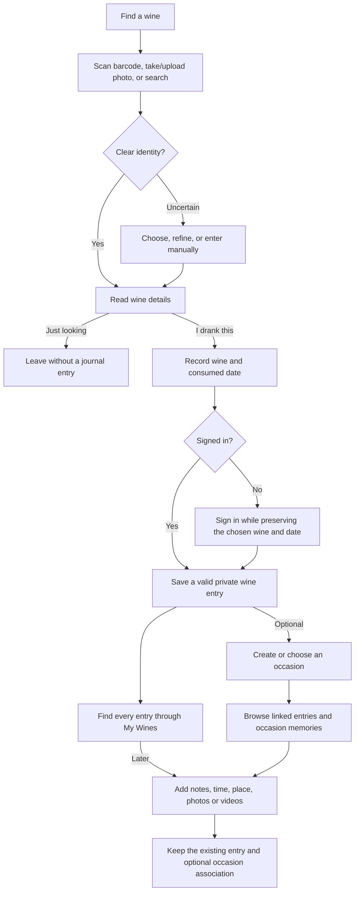

# Wine Journal product story map

Status: evolving product story map. Confirmed answers constrain implementation; unresolved controls remain proposals. Repository scaffolding was separately authorized in [ADR 0005](../docs/decisions/0005-repository-foundation.md), without marking these product features implemented.

## Purpose and working agreement

Help a casual wine drinker or enthusiast identify wines, preserve experiences, and understand personal preferences. The first release offers public wine lookup and a private web journal. Public user reviews/profiles, feeds, shared occasions, and native iOS are later directions. My Wines is the primary view for all wine records; Occasions is a secondary, more artistic scrapbook view for experiences deliberately grouped by the user. A later calendar should cover all drinking entries, including those without an occasion.

Confirmed minimum capture: save the wine and consumed date, then return to fill in optional details. Quick notes may be added immediately, but notes/rating/place/photos/videos are not required. A minimal saved entry is a valid experience, not an unfinished draft the user must complete. Adding photos/videos later describes the user's enrichment workflow, not a change to their release scope. A separate confirmed scenario is looking up specs with friends (producer notes, origin, available prices, etc.) without recording a tasting. Confirmed access: lookup works without signing in; saving a personal experience requires sign-in.

Confirmed rating rule: one current personal rating belongs to the wine itself. The user may change it after subsequent glasses/bottles or at another time; retain past scores and change dates. Display the current chosen rating, not an average of its revisions. Rating changes are distinct from drinking occasions and do not create tastings. Following the user's uniqueness clarification, the working recommendation is one current score/history per identifiable vintage or release, with no implicit combined score when related wines are grouped. Rating scale, correction/removal behavior, and unresolved-identity conflicts still need refinement.

Supabase is the accepted direction for managed Postgres/Auth/private Storage, subject to the local/free budget. Technology details live in the architecture records; this story map defines product behavior rather than hosting configuration.

Latest occasion clarification: a drinking entry can stand alone. Wine plus consumed date remains sufficient for a sample, a glass at home, or any other encounter. Time and location are optional details independent of an occasion. An occasion is an optional grouping of one or several entries, with the ability to add a title such as Dinner with X, Y, Z, date/time, location, general notes, and a scrapbook. This replaces the earlier proposal to create an unnamed occasion for every save. Standalone entries can also have notes/photos/videos; richer memories do not require an occasion. Exact title requirements and shared-context editing remain UX proposals.

Latest expansion idea: the user would like to explore people participating in a shared occasion, collaborative notes/reviews, and a shared photo/video memory space later. Recommended terminology is People / Invite people in the interface, Participants for accepted members, and Shared album / Memories for contributions. These are later directions, not MVP collaboration requirements. Mentioning a person in a title does not invite them, grant access, or create an account relationship.

Latest identity clarification: preserve distinct wines, vintages, and releases; intuitive sorting/filtering and grouping must not erase those distinctions. The user cited Calculated Risk Cabernet Sauvignon and requested research. [Wine identity research](wine-identity.md) establishes real examples and a proposed conceptual model. Exact card grouping remains a UX choice to test, not a settled requirement.

Latest notes clarification: free-form notes and optional guided suggestions belong in the MVP direction, especially to help beginners. The user requested research into useful guidance. A full structured tasting assessment remains later; prompts, vocabulary, and exact controls are proposals in [tasting notes research](tasting-notes.md).

The existing technical discussion is in [plan.md](plan.md); [occasion journeys](occasion-journeys.md) map the two views and shared memories. This document is now the working source for story scope and product decisions. It does not turn earlier assistant recommendations into user-approved requirements.

Current phase: after reviewing the connected prototype, the user requested architecture, system design and folder-structure planning. The current technical proposal is in [architecture.md](../docs/architecture.md); [UX review 04](ux-review-04.md) records the latest navigation, occasion wine cards and wine photo highlights. This story map remains the product scope source. Exact controls and unresolved requirements are not made final by the architecture draft; no application code is requested yet.

## How we will work through the product

1. Review this capability/story map and identify gaps and release boundaries.
2. Walk through concrete scenarios one at a time, refining story acceptance rules and unresolved decisions.
3. Sketch rough user journeys alongside those stories: entry point, action, feedback, outcome, and recovery.
4. Turn the core journeys into low-fidelity screens and a clickable UX prototype, then walk realistic examples through it.
5. Revise the MVP stories based on the prototype; agree the release's acceptance criteria.
6. Revisit technical design, provider feasibility, and implementation slices before any build begins.

This is iterative: rough flow thinking starts during story discovery; polished visuals follow validated journeys. We need enough definition for later expansions to preserve the right boundaries, not detailed designs for every future feature now.

Each story review should establish: actor and context; desired outcome and value; trigger; success criteria; empty/error/recovery behavior; relevant privacy boundary; release intent; dependencies; and any unanswered product decision. This is a product exercise, not an API/database design exercise.

## Scope labels

- **MVP target:** the capability follows the user's stated first-release direction. Acceptance details may still be open.
- **MVP proposal:** recommended supporting behavior that has not been explicitly selected yet.
- **Later direction:** the user has expressed interest beyond the private core, without a committed delivery date.
- **Explore:** a suggested opportunity, not a promised feature.
- No release label here is an effort estimate. Scope changes must be recorded explicitly.

## Proposed capability boundaries

Stable capability IDs organize discussions and eventual specs; they do not prescribe deployable services or code folders. This is a proposed map for review.

| Capability ID | User responsibility | Depends on |
| --- | --- | --- |
| account-access | Access and regain access to a personal journal; establish private ownership | None |
| wine-catalog | Find a wine, view its identity/details/links, and handle corrections or unknown wines | None for reading; account-access for owner-only records |
| wine-identification | Resolve barcode or bottle-photo input into wine details, including for visitors | wine-catalog |
| tasting-journal | Record standalone wine entries with when/where and optionally group them into titled occasions | account-access, wine-catalog |
| occasion-media | Attach, view, and manage private photos/videos on a wine entry or an occasion; stable capability ID retained | tasting-journal |
| history-browsing | Browse primarily by wine or secondarily by occasion; optionally browse a calendar later | tasting-journal; occasion-media when attachments exist |
| taste-profile | Maintain personal wine ratings/history and understand preferences | account-access, wine-catalog; tasting-journal for experience summaries |
| public-community | Deliberately publish/read reviews and maintain community trust | account-access, wine-catalog; optional copying from tasting-journal later |
| wine-discovery | Browse the wine catalog and later discover personalized or trending wines | wine-catalog; public-community only for public activity/trends; taste-profile for personalized suggestions |
| wine-guides | Learn about tasting, styles, pairings, and regions; explore related wines | Editorial content; wine-catalog for related links; taste-profile only for later personalized learning |
| shared-occasions | Later: invite participants and contribute to selected shared occasion notes/media | account-access, tasting-journal, occasion-media; public-community only for separately published coauthored reviews |

Discussion order: identify a wine -> record a drinking entry -> optionally group entries into an occasion -> attach memories -> revisit by wine -> understand preferences -> account/data controls -> later sharing/public/discovery experience. Technical build order is intentionally not fixed yet; core dependencies suggest account/catalog foundations, then journal, media/history/profile, and later shared or public capabilities. Private group collaboration need not depend on a public feed. Identification consumes catalog identity and can be added without redefining the journal.

Delivery channels such as mobile web and native iOS apply across these capabilities. They are not an extra journal database or a separate set of product rules.

## Boundary rules already supported by the conversation

- Looking up or scanning a bottle displays wine details; it does not itself assert that the user drank it.
- Visitors can scan/photo/search and view wine details. Sign-in is required to save a personal experience; this is distinct from the later public-community phase.
- Recording an experience creates a wine entry with a consumed date and optional time/place. It can exist without an occasion; no unnamed event is automatically required.
- An occasion optionally groups one or several entries. Users can title it and add event context; a wine can recur in entries within or outside occasions. One occasion may be modest or celebratory at the user's discretion.
- Recording another encounter preserves earlier entries. Adding or linking an entry to an occasion must not duplicate that entry, its rating, or its media.
- Wine and date remain sufficient for quick saving. Date, time, and location alone must not silently group entries into occasions.
- Notes and photo/video memories are available on standalone entries. Occasion albums provide additional group context, with exact preview/association controls to review.
- Recommended context rule: occasion details can prefill new entries; entries retain their own when/where. Linking an existing entry or editing an occasion does not silently overwrite recorded consumption details.
- The wine-level personal rating and its history are independent of occasions.
- Distinct identifiable vintages/releases retain their identities when the library is sorted, filtered, or grouped. Recommended rating scope is per identifiable release; do not silently blend scores across a group.
- Free-form notes remain available alongside optional beginner guidance. Guidance offers language to describe the user's experience; it does not automatically insert producer claims as personal observations.
- Publishing later is a deliberate separate action; private notes and media are not automatically shared.
- Wine history orders experiences by consumed date. The library's proposed default order uses the latest consumed date per wine, not the entry creation date.
- Unknown vintage is distinguishable from non-vintage and from a known year.
- Calendar and wine views reach the same experiences; they do not maintain duplicate records.

## Story inventory: private product

Acceptance examples below are review prompts, not a finalized specification. Recommendations or unresolved rules are labeled.

| ID | Scope | User story | Initial acceptance example / open rule |
| --- | --- | --- | --- |
| AC-01 | MVP target | As a journal owner, I want to sign in to save and return to my journal so my memories persist between visits. | Lookup is available before sign-in. Saving requires an account; carry the chosen wine/date through sign-in. Sign-in methods remain open. |
| AC-02 | MVP proposal | As a returning owner, I want to regain access when I cannot sign in so I do not lose my history. | Recovery behavior follows the chosen sign-in method; do not prescribe passwords yet. |
| AC-03 | MVP target | As an owner, I want my journal and attachments accessible only to me so personal occasions remain private. | Another account cannot read/change an entry or obtain private media access through the journal or guessed identifiers. Media-link access/lifetimes and any explicit sharing must be specified without overstating privacy guarantees. |
| AC-04 | MVP proposal | As an owner, I want to take my data with me or remove my account so I control my personal history. | Define a practical export and account-deletion outcome, including attachments, before inviting users to store long-term memories. |
| WC-01 | MVP target | As a drinker, I want to look up a wine by name, producer, or label wording so I can find it without a code or photo. | Matching results distinguish similar names/vintages; zero results offers a manual route. |
| WC-02 | MVP target | As someone discussing a wine with friends, I want to read its specs without signing in or recording a tasting so I can learn about the bottle in the moment. | Show available producer, origin, style/grapes, vintage, ABV, sourced tasting notes, and price context; label unknowns and distinguish price source/currency/date from confirmed live availability. Viewing details never saves an experience automatically. |
| WC-03 | MVP target | As a drinker with an unrecognized wine, I want to create a personal wine record so missing catalog coverage does not prevent journaling. | Save a recognizable owner-only identity with unknown fields allowed; minimum identity fields are open. A draft can be created inside an occasion's add-wine flow without losing the occasion. |
| WC-07 | MVP target | As a drinker adding a wine manually, I want to choose a bottle photo as its cover so I can recognize it in My Wines. | Optional upload, preview, replace, and remove; retain typed identity fields. The personal cover is distinct from encounter memories and photo identification, and is not automatically published to the shared catalog. |
| WC-04 | MVP target | As a journal owner, I want to correct a mistaken wine or vintage so my history stays accurate. | Correct the affected record/occasion without silently changing everyone else's catalog or erasing its memories. |
| WC-05 | MVP target | As a drinker, I want a producer or purchase link when available so I can learn more or find the bottle again. | Known listings and general retailer searches have distinct labels; absence of a link is a valid state. |
| WC-06 | MVP target | As a drinker, I want distinct offerings, vintages, and releases kept separate so my journal records the wine I actually drank. | Distinguish Calculated Risk Napa Valley Barrel Selection 2023/2024 and Sonoma County Reserve 2023. Known editions, non-vintage/multi-vintage status, and unknown vintage remain distinguishable. Exact identity resolution rules are proposed in wine-identity.md. |
| WI-01 | MVP target | As a drinker with a barcode, I want to scan it and see wine details automatically so I avoid typing. | A clear match opens details; uncertain identity or vintage asks only for the unresolved choice. |
| WI-02 | MVP target | As a drinker without a barcode, I want to take/upload a bottle photo so the app can identify the wine. | Photo capture/upload is directly available; show a result or plausible candidates and provide search/correction. |
| WI-03 | MVP target | As a drinker, I want to resolve uncertain results so a wrong match does not enter my journal unnoticed. | See the distinguishing information and choose a candidate, refine input, or reject all results. |
| WI-04 | MVP target | As a drinker whose scan/photo lookup fails, I want a useful next step so I can still record the experience. | Camera denial, unreadable input, no match, or service failure leave search/manual continuation available and preserve current form input. Offline/background persistence is not implied. |
| TJ-01 | MVP target | As a drinker, I want to save the wine and date quickly so I can capture the experience now and add details later. | Save a standalone wine entry without creating an occasion. Time, location, rating, notes, and media are optional. The user can deliberately add an occasion association now or later. |
| TJ-02 | MVP target | As a returning drinker, I want to record another encounter with an existing wine so each encounter keeps its own memories. | Retain earlier entries; new encounters may be standalone or associated with an occasion. Allow distinct encounters on the same day. |
| TJ-03 | MVP target | As a drinker, I want to record when/where I drank a wine and my observations so I can remember the encounter without needing an occasion. | Each wine entry has its own consumed date, optional time/location, and personal notes. If linked, the occasion also has its own title/context. Proposed occasion defaults must not silently overwrite recorded entry details. The personal numeric rating belongs to the wine itself (TP-04). |
| TJ-04 | MVP target | As an owner, I want to return to an experience to enrich, correct, or remove information so I retain control of my memories. | Edit a standalone or grouped entry without requiring an occasion. Unlinking an entry, deleting it, and deleting an occasion are distinct actions. Recommended removal behavior preserves entries/entry media when an occasion is removed; occasion-owned album handling needs explicit design. |
| TJ-05 | MVP target | As a drinker having several wines at one occasion, I want to record them together so one dinner or visit stays one memory. | Each included wine reaches the same occasion from its history and keeps its own observations. This promotes former exploratory story EX-07 into core scope. |
| TJ-06 | MVP target | As a drinker creating or editing an occasion, I want to identify and add a new wine there so I can build the whole gathering without pre-logging its wines. | Search, barcode, photo, and manual creation return to the same occasion with context retained. Date/location can prefill new entries; exact drinking time remains blank. Proposed draft behavior stages new entries until the occasion is saved, with cancel/edit/remove and no duplicates. Adding to an already saved occasion saves the new entry and returns to its scrapbook. |
| TJ-10 | MVP target | As a drinker logging a wine, I want to create a new occasion in that flow so I can group this encounter without abandoning my entry. | Preserve wine, date, notes, and attachments; create the occasion inline and select it for this entry. Proposed save commits entry and new occasion together after sign-in if needed. Canceling occasion creation leaves the entry intact. |
| TJ-11 | MVP target; provider pending | As a drinker, I want to select an official place or type a personal location label so both restaurants and a friend's home fit my journal. | Offer place search on entries and occasions, disambiguate similar names with locality/address, and retain free text without a provider match. Editing a selected label clears its stale place association. Search failure must leave custom entry usable; current-location permission is optional. Google Places feasibility and terms remain a later integration decision. |
| WD-04 | MVP proposal | As a visitor or returning drinker, I want a Browse Wines catalog so I can explore bottles beyond my personal journal without recording consumption. | Anonymous search and detail viewing; log only by deliberate action and sign in to save. Keep private manual wine records out of the shared catalog. Recommendation and trending views are later directions, independent of basic browsing. |
| WG-01 | MVP proposal; breadth open | As a curious drinker, I want a Guides section covering wine styles/grapes, tasting words, pairings, and regions so I can learn at my own pace. | Short, sourced editorial guides are accessible without sign-in and linked from relevant wine/discovery contexts. Reading a guide does not log drinking or change a rating. Prototype coverage does not commit to a full reference encyclopedia. |
| TJ-08 | MVP target | As a journal owner, I want to title an occasion and record its location and date/time so a gathering has meaningful context. | Example: Dinner with X, Y, Z, a restaurant, and an optional time. It may group one or several wines. Exact required occasion fields remain to be finalized; creating an occasion is always optional for wine logging. |
| TJ-09 | MVP proposal | As an owner, I want to link or unlink previously saved wine entries to an occasion so I can organize memories later without logging them twice. | Preserve entry identity, when/where, personal notes/media, and wine rating/history. Recommended MVP limit: at most one occasion per entry. Resolve differing context explicitly; do not duplicate entries or silently merge occasions. |
| OM-01 | MVP target | As an owner, I want to attach photos to a wine entry or occasion so I can remember the bottle and the moment around it. | A standalone entry supports its own photos; an occasion supports general memories. Adding/removing an occasion link does not require re-uploading or erase entry photos. Exact album previews remain proposed. |
| OM-02 | MVP target | As an owner, I want to attach and play videos on a wine entry or occasion so moving memories live with my notes. | No occasion is required for supported private clips. Duration, size, count, format, and recording-versus-upload behavior are open. |
| OM-03 | MVP proposal | As an owner, I want to manage attachments and recover failed uploads so media problems do not erase my experience. | Retry/remove a failed attachment while retaining the saved wine entry or occasion; cover-photo and ordering controls are candidates to review. |
| HB-01 | MVP target | As a returning owner, I want to browse My Wines so I can quickly recognize bottles I have tried. | Reuse a recognizable record for repeat encounters with the same identifiable release. Related vintages can be grouped visually without merging identities or scores; exact card layout remains open. Proposed default order is latest consumed date first. |
| HB-02 | MVP target | As an owner, I want to open a wine and see every time I drank it so I can revisit both everyday entries and occasion memories. | Show consumed date, optional time/place, entry notes/media, and an occasion link when present. Standalone entries remain fully usable. Current wine rating and rating-change history remain separate. |
| HB-05 | MVP target | As an owner, I want to browse by occasion so I can revisit whole dinners or visits with all their wines and memories. | Secondary Occasions shows only explicitly created occasions and the same linked entries reached from My Wines. Standalone entries remain in My Wines; later calendar includes them too. |
| OM-04 | MVP target | As an owner, I want an occasion to read like a personal scrapbook so I can enjoy its photos, videos, and notes together. | The secondary occasion view emphasizes memories and includes its wines. Covers, captions, ordering, and guided layouts are design proposals; free-form editing is not yet committed. |
| HB-03 | MVP target | As an owner, I want to search/filter my history so I can recover a bottle I partly remember. | Search my recorded wines, not just the global catalog. Type, origin, vintage/edition, personal rating, and consumed-date filters are candidates; the smallest useful initial set remains to be selected. Unknown values must remain recoverable. |
| HB-06 | MVP target | As an owner, I want to choose how My Wines is sorted so I can browse it in a way that suits what I am looking for. | Proposed options: most recently consumed, name, and current personal rating. Reordering does not merge releases or alter occasions; exact options, unrated placement, and saved preferences need UX review. |
| TP-01 | MVP target | As someone learning about wine, I want a summary of my recorded preferences so I can see what I have enjoyed and explored. | Show understandable summaries with contributing records/counts; exact metrics and small-sample wording remain open. |
| TP-02 | MVP proposal | As a drinker, I want to record explicit likes/dislikes or whether I would buy again so my profile reflects more than a number. | Distinguish an explicit preference from an inferred pattern; decide whether this is per occasion or a separate wine-level preference. |
| TP-04 | MVP target | As a drinker, I want to change my personal rating of a wine and see past ratings so I can understand how my opinion has changed. | One current chosen score with dated past scores; recommended scope is each identifiable vintage/release. A change neither adds an occasion nor averages prior scores into the current rating. Scale, correction/removal behavior, and unresolved-identity rating conflicts remain open. |
| TJ-07 | MVP target | As someone learning about wine, I want optional prompts and suggestions beside my free-form notes so I can describe what I noticed in my own words. | Guidance works on any wine entry, with or without an occasion. Skips and broad/custom descriptions are valid. Observations do not overwrite free text or the current wine rating and remain separate from producer descriptions. Exact controls are proposed in tasting-notes.md. |

## Story inventory: later directions

| ID | Scope | User story | Boundary / decision to revisit |
| --- | --- | --- | --- |
| HB-04 | Later direction, secondary | As an owner, I want a calendar so I can revisit what I drank by date. | Show standalone and occasion-linked entries using their consumed dates; label occasion context without duplicating entries. Distinguish entry, wine/release, and occasion counts. |
| TP-03 | Later direction | As an enthusiast, I want a more detailed structured tasting record so I can compare experiences systematically. | Full multi-attribute scales, detailed assessment, and comparative analytics remain later. Basic optional prompts, terminology help, and free-form notes are now MVP story TJ-07. |
| PC-01 | Later direction | As a reviewer, I want to publish selected review text and a rating so I can share my opinion while keeping personal memories private. | Explicit preview and publication; edits to private notes do not silently change the public copy. |
| PC-02 | Later direction | As a reader, I want a wine page with public reviews and rating counts so I can see other people's opinions. | Define vintage grouping and one contributor's effect on aggregate scores; private repeat tastings never count implicitly. |
| PC-03 | Later direction | As a reviewer, I want a public profile so readers can find the reviews I choose to share. | Display identity and published content; private history/taste profile is not automatically public. |
| PC-04 | Later direction | As a reviewer, I want to edit or unpublish my review so I retain control of my public opinion. | Define visible changes, public score recalculation, and any later media link behavior. |
| PC-05 | Later supporting requirement | As a community member, I want to report inappropriate content so participation remains useful. | Available alongside public posting, with a meaningful acknowledgement and moderation path. |
| PC-06 | Later supporting requirement | As a moderator, I want to review reports and hide/remove abusive content so I can operate the public community. | Scope alongside the first public release; moderators do not gain casual browsing access to private journals. |
| WD-01 | Later direction | As a reader, I want a feed of recent public reviews so I can discover wines people are discussing. | Initially real public activity; empty/demo content is labeled accurately. |
| WD-02 | Later direction | As a reader, I want to browse popular or trending wines so I can explore wider interest. | Define qualifying public signals, time window, and minimum sample size; never manufacture trends from private activity or seed data. |
| WD-03 | Later direction | As a drinker, I want similar-wine suggestions with reasons so I can explore beyond wines I already know. | Explain shared characteristics; preserve uncertainty from missing wine attributes or limited personal history. |
| WG-02 | Later direction | As a learner, I want relevant guides and wine suggestions connected to my taste profile so I can understand and explore my preferences. | Explain connections to current wine ratings, explicit preferences, or known wine attributes. Keep learning interests distinct from evidence of liking a wine; reading an article or repeatedly logging a wine does not automatically count as a positive rating. |
| CH-01 | Later direction | As an iPhone user, I want to capture and revisit my journal in a native app so it fits how I use my phone. | Same account, wines, and experiences; native capture/navigation design comes later. |
| SC-01 | Later direction | As an occasion organizer, I want to invite people I shared the wine with so we can revisit selected memories together. | An accepted invitation establishes scoped participation. A name mentioned in a title or private people list does not grant access. Invite/access details remain open. |
| SC-02 | Later direction | As a participant, I want to add photos/videos to a shared occasion album so everyone's chosen memories can be collected together. | Contributions retain ownership/attribution and an explicit shared audience; personal entry albums are not silently exposed. Removal and retention rules need design. |
| SC-03 | Later direction | As a participant, I want to contribute to shared occasion notes so we can tell the story together. | Shared contributions are separate from each person's private observations and ratings. Attributed additions versus a jointly edited note remains a product choice; concurrent-edit handling belongs to this later feature. |
| SC-04 | Later supporting requirement | As an organizer or participant, I want understandable controls for access and contributions so I know who can see or change shared memories. | Define invitations, roles, leaving/removal, deletion/export, and private versus shared visibility alongside collaboration. Joining does not imply drinking every wine or automatically populate a personal journal. |
| SC-05 | Later direction, exploratory details | As participants, we may want to coauthor a wine review so we can deliberately share a joint opinion. | Clarify private group commentary versus public coauthored review. Public publication requires explicit audience/authorship approval and score semantics; never overwrite individual ratings or count one joint score as multiple independent reviews. |

## Suggested expansions to explore, not commitments

| ID | Opportunity story | Why it might help / what makes it separate |
| --- | --- | --- |
| EX-01 | As a drinker, I want a want-to-try list so I can save wines I have not drunk yet. | Useful discovery follow-through; must not falsely add a tasting or alter consumed-date history. |
| EX-02 | As a busy drinker, I want to save a photo before identifying the wine so I can finish identification later. | Separate from the selected minimum of wine plus date; remains exploratory. Durable unidentified drafts need explicit status and retrieval behavior. |
| EX-03 | As a traveler, I want to save experiences without connectivity and sync later so a poor signal does not stop capture. | Different from preserving a form during an error; requires explicit offline and conflict behavior. |
| EX-04 | As a reader, I want to follow reviewers whose tastes I trust so my feed becomes personally useful. | Adds follow/privacy/blocking decisions; not required for a recent-reviews feed. |
| EX-05 | As a member, I want to comment or react to reviews so I can discuss wines with others. | Adds conversations, notifications, and moderation scope beyond publishing reviews. |
| EX-06 | As a reviewer, I want to publish selected occasion photos/videos so I can illustrate a review. | Requires a separate publication preview and public-media lifecycle; never shares the whole private gallery. |
| EX-08 | As a drinker, I want to compare current retailer offers so I can find an available bottle in my market. | Expands static links into availability, freshness, region, and merchant-data requirements. |

No current commitment to checkout/payments, cellar inventory, general-purpose forum threads, direct messaging, automatic social posting, custom model training, or general event planning/ticketing. Focused occasion collaboration is now a later direction in SC-01 through SC-05, separate from the private MVP.

Scope change: EX-07 is now TJ-05, an MVP target. Occasion participation and shared contributions are separately scoped for later in SC-01 through SC-05. They do not add collaboration to the private MVP.

Model correction: wine entries can exist without occasions. TJ-01/TJ-03 now express independent when/where; TJ-08 adds titled occasion context and TJ-09 proposes linking/unlinking later. This supersedes the implicit unnamed-occasion model.

Scope refinement: optional beginner tasting guidance is now TJ-07, an MVP target following the user's clarification. TP-03 retains the deeper structured assessment/analysis expansion.

## First stories to discuss: finding a wine

These examples refine the draft story map; they do not establish implementation requirements before the product review.

### WI-01: Barcode to details

Context: I have a physical bottle with a readable barcode and want its information quickly.

Story: As a drinker, I want to scan the bottle's barcode and see its details so I can identify what I am drinking without typing.

Acceptance examples:
1. Given a clear supported match, scanning opens wine details and an action to record an experience. Merely scanning does not create a tasting.
2. Given an unresolved vintage or several plausible identities, I can resolve that distinction or leave an allowed field unknown; the app does not invent a year.
3. Given an unreadable/unknown code, I can retry, photograph the bottle, search by text, or proceed through manual entry.

Confirmed access: lookup works before signing in. Open decisions: How are unknown fields presented? When is a candidate sufficiently clear to skip selection? Quality thresholds need a separate provider evaluation later.

### WI-02: Photo to details

Context: The wine has no accessible code, or photographing the bottle is easier.

Story: As a drinker, I want to photograph/upload the bottle so I can identify it without a barcode.

Acceptance examples:
1. I can choose photo capture or an existing image directly; I do not have to fail a barcode scan first.
2. I can inspect a result or select from uncertain matches, and correct/reject the suggested wine.
3. If nothing useful is recognized, my current image/input remains available while I refine it, search, or enter the wine manually; durable save-for-later is still an open decision.

Open decisions: Is the identification image automatically retained on the private wine entry, or used only for lookup unless selected? Can an unidentified photo become an unfinished journal entry? Back-label and multiple-image support can be scoped separately.

### WC-01: Text lookup

Context: I know part of a name, can read the label, or do not want camera access.

Story: As a drinker, I want to search using wine or producer information so I can find the right bottle without taking a photo.

Acceptance examples:
1. Search is available directly, not hidden behind identification failures.
2. Results show useful differences between similar wines/vintages, and selecting a result opens details without creating a tasting.
3. No results leads to a clear refinement/manual-entry path, not a dead end.

### WC-02: Look up specs without journaling

Context: I am drinking/discussing a wine with friends and only want information about the bottle.

Story: As a drinker, I want to view its origin, tasting notes, year, and available price information so I can understand and discuss it without creating a personal entry.

Acceptance examples:
1. All three identification/search paths can lead to the same wine-details experience; lookup does not add a wine to My Wines or create a tasting.
2. I can read available specs, distinguish sourced wine notes from any personal notes, and leave without being required to rate or save.
3. Missing specs/prices are clearly absent rather than fabricated. A displayed price identifies its context, such as merchant/currency and freshness when known; it does not automatically promise local stock.

Confirmed access: anonymous lookup is allowed; sign-in is required to save an experience. Proposed transition acceptance: preserve the chosen wine and any entered date/notes across the sign-in flow, return to the intended recording context, and make successful saving explicit. Canceling sign-in must not create an experience. Exact navigation and available sign-in methods remain a UX decision.

### TJ-01 and TJ-04: Save now, enrich later

Context: I want to remember what I drank but do not want to spend time completing a form during the occasion.

Story: As a drinker, I want to save a wine and date now, then return to add notes or media so capturing a memory does not interrupt the moment.

Acceptance examples:
1. Given a chosen/manually named wine and consumed date, I can save without a rating, notes, place, photo, or video. Defaulting the date to today, with an editable date, is a UX recommendation to review.
2. The saved experience is valid and visible in that wine's history. It is not presented as incomplete solely because optional detail is absent.
3. Returning to add context/media or wine-specific notes enriches the same wine entry and preserves its date. No occasion is required. "Log again" creates another encounter; "Add to occasion" optionally associates the existing entry with a group. Updating a wine's personal rating remains separate (TP-04).

### TP-04: Current personal wine rating with history

Context: I have an opinion of a wine; drinking it again or reflecting later may change that opinion.

Story: As a drinker, I want to update the wine's personal rating while retaining previous scores so I can see both what I think now and how that changed.

Acceptance examples:
1. I can set an optional personal rating for the wine and change it later. The wine page displays the latest score I chose, not an average of revisions. Under the working identity recommendation, Barrel Selection 2023 and 2024 have independent scores/history even if grouped together in My Wines.
2. Previous scores and their change dates remain accessible in a private rating history. These dates describe rating changes, not necessarily drinking dates.
3. A rating update does not create a tasting or rewrite existing occasion notes/dates/media. Logging another glass/bottle does not require a rating change. Public review scores remain a later, separate publication decision.

Illustrative history (values demonstrate the behavior, not an agreed rating scale): current 4.5; previously 4.0 on June 8, and 3.5 on April 5. These revisions are one person's changing opinion, not three independent contributors or tasting counts.

Open decisions: scale/step size, removing a rating or correcting an accidental score, and resolving rating conflicts after identity corrections. An unresolved vintage is not a shared rating across all vintages. Whether rating a wine requires a prior logged occasion can be reviewed with entry-point design; no rating action automatically creates an occasion.

### Rough journey skeletons for these confirmed intents

These describe user outcomes, not final navigation or screen layouts. The access boundary is confirmed; sign-in navigation details remain to be designed.

Error/recovery branches such as provider failure and denied camera permission are stories WI-03/WI-04 and will be expanded in the next flow pass. A failed lookup can continue via manual identity; it is not a claim that all inputs resolve correctly.

## Decision queue for subsequent conversations

Only ask the next relevant question; this list is not a questionnaire to answer all at once.

1. **Resolved: minimum capture.** Wine plus consumed date; optional quick notes, rating, place, and photos/videos can be added later. Valid saved experiences need no completion status solely because optional details are missing.
2. **Resolved: account boundary.** Visitors can look up details by barcode, photo, or text without signing in; saving a personal experience requires sign-in.
3. Consumed-date UX: default today (recommended), optional time/location, backdating, and whether partial/unknown dates are needed for older memories. Entry when/where exists independently of an occasion.
4. **Resolved: meaning of rating history.** One current personal rating belongs to the wine; retain previous scores/change dates. It is independent of drinking occasions and is not an average. Apply per identifiable release as the working recommendation after the uniqueness clarification; discuss scale and correction/removal next.
5. Test My Wines layouts that distinguish releases while offering useful related-vintage grouping; choose a recognizable card summary through UX examples.
6. Select the first sort/filter options based on concrete retrieval questions; calendar remains later than both core views.
7. Photo/video capture versus upload, clip/file limits, ordering, cover selection, and whether the scan image is kept.
8. The first taste-profile outputs and how to describe weak/incomplete evidence.
9. Account entry/recovery and export/deletion expectations.
10. Later public publication, review grouping, profile visibility, moderation, and feed rules.

11. **Resolved: several wines in one occasion.** Keep one shared occasion and wine-specific entries, accessible through each wine history. Several bottles do not imply several occasions.
12. **Resolved direction: two core views.** My Wines is primary record keeping; Occasions is a secondary, more artistic scrapbook. Calendar remains a later optional navigator.
13. **Resolved principle: unique wine identities; flexible organization.** The user wants distinct offerings/years/releases preserved and sorting/filtering options. Research is recorded in wine-identity.md. Per-release personal scores and distinct-release items are working recommendations; visual grouping is still open for UX testing.
14. Media detail: standalone entry media and general occasion albums are both supported; combined previews, associations, cover/caption/order controls, and removal behavior need review.
15. **Resolved direction: free-form notes plus optional guidance.** Include beginner-friendly suggestions in MVP; research and draft prompts are in tasting-notes.md. Detailed attribute scales and exact vocabulary remain design choices to review.
16. **Resolved principle: an occasion is optional.** Everyday samples/glasses can be standalone entries with date, optional time/location, and optional notes/media. Users can title and add context to occasions they deliberately create. No unnamed occasion is required behind each save.
17. **Later direction: shared occasions.** Explore invited participants, shared albums/notes, and possibly coauthored reviews. Define private versus group versus public content and authorship before this later release.

Do not resolve unanswered decisions by elapsed time or by treating example acceptance criteria as approved. Future user flows and low-fidelity wireframes should cite story IDs and make unresolved behavior visible.

## Review progress

- [x] Preserve the user's established vision and latest no-development boundary.
- [x] Map current and later capabilities with distinct scope labels.
- [x] Resolve minimum capture: wine/date now, optional enrichment later; separately support lookup without saving.
- [x] Resolve account access: public lookup, sign-in required for personal saving.
- [x] Resolve rating ownership: current personal wine score with revision history, independent of occasions.
- [x] Promote multi-wine occasions to core scope and distinguish primary My Wines from secondary occasion scrapbooks.
- [x] Separate standalone wine entries and their when/where from optional titled occasions; record focused collaboration as a later expansion.
- [x] Research real wine identity examples and preserve distinct releases with flexible sorting/filtering.
- [x] Add optional beginner tasting guidance alongside free-form notes to MVP direction; research supporting approaches.
- [x] Draft acceptance examples and rough journeys for the two confirmed intents.
- [ ] Review remaining story boundaries, initial library layout/filter set, rating controls, and release membership with the user.
- [ ] Refine each MVP story's acceptance and recovery behavior.
- [ ] Map the core journeys and produce low-fidelity UX flows after the relevant story decisions.
- [ ] Agree an MVP release definition before technical implementation planning.
